## 🏛️ API Management × MCP

- **상황**: 이미 잘 만든 REST API들(상품/주문 등)이 있고, 이제 LLM이 스스로 **필요한 API만 골라 호출**해 답을 만들게 하고 싶음.
- **문제**: 그냥 열어두면 **보안·남용(과다 호출)·비용·버전 관리** 리스크가 큼.
- **해결**: **APIM(정문 관리소)** 앞단 배치 → 인증/레이트리밋/쿼터/변환 정책 적용 → 노출할 API만 선별.
  - APIM 게이트웨이 앞단 배치, 백엔드로 키 전달 제거 권장을 통한 **Token Passthrough** 방지
- **MCP 연계**: APIM 뒤에 **MCP Server**를 두고 선택한 API들을 **MCP Tools**로 래핑/카탈로그화(`tools/list`, `tools/call`).
- **동작**: VS Code·Copilot 등 AI 클라이언트가 **툴 목록을 받아 표준 방식으로 호출**하므로, 안전하고 일관된 통합 가능.
- **아키텍처**: `Client/Host → APIM(auth/rate/transform) → MCP Server(/mcp) → Backend REST APIs`
- **핵심 목표**: 기존 REST API → (APIM에서 선택·정책 적용) → MCP Server 엔드포인트로 변신 → AI 도구 생태계에 “안전·관리형” 편입

> 하단의 내용은 [MCP in Action: Real-World Case Studies](https://github.com/microsoft/mcp-for-beginners/blob/16039eb5fd6a26cb5e4e36d241a86c21d6d77aad/09-CaseStudy/apimsample.md) 를 일부 참조하여 작성되었습니다.

# Case Study: Azure API Management의 REST API를 MCP 서버로 노출하기

Azure API Management(APIM)는 API 엔드포인트 앞단의 **게이트웨이**로 동작하며, 들어오는 요청을 프록시/정책 기반으로 제어합니다. APIM을 사용하면 다음과 같은 기능을 쉽게 추가할 수 있습니다:

* **보안(Security)**: API Key, JWT, Managed Identity 등 다양한 인증/인가 방식을 적용 가능.
* **요청 제어(Rate limiting)**: 단위 시간당 허용 호출 수를 제한하여 사용자 경험을 보호하고 백엔드 과부하를 방지.
* **스케일링 & 로드밸런싱**: 여러 백엔드로 부하 분산 및 확장 전략 구성.
* **AI 게이트웨이 기능(시맨틱 캐싱, 토큰 한도/모니터링 등)**: 지연시간 단축, 토큰 비용 가시화·제한 등 지능형 정책 제공.

## 🤝 왜 MCP + Azure API Management인가?

MCP(Model Context Protocol)는 에이전틱 애플리케이션에서 **도구와 데이터 노출의 표준**으로 빠르게 자리 잡고 있습니다. MCP 서버는 종종 외부 API를 호출해 툴 요청을 처리하므로, **API 관리를 위한 표준 게이트웨이인 APIM**과 결합하면 운영·보안·거버넌스 면에서 자연스러운 선택이 됩니다.

### Overview

해당 사례에서는 **REST API 엔드포인트를 MCP 서버로 노출**해, 에이전트 앱에서 바로 사용할 수 있도록 하면서 APIM의 기능(보안/정책/관측성)을 함께 활용하는 방법을 다룹니다.

### Key Features

* MCP **툴로 노출할 HTTP 메서드/오퍼레이션**을 선택적으로 지정.
* 부가 기능은 APIM **정책(Policy)** 구성에 따라 달라지며, 예시로 **rate limiting 정책** 적용을 보여줍니다.

---

## 📥 Prerequisites: API 가져오기(Import)

> 이미 APIM에 사용하고 싶은 API가 있다면 이 단계를 건너뜁니다. 없다면 **OpenAPI/URL/리소스**에서 API를 가져오는 방법을 참고하세요. [MS Learn Tutorial: Import and publish your first API](https://learn.microsoft.com/en-us/azure/api-management/import-and-publish). 해당 튜토리얼 예제에서는 [오픈소스 Petstore API](https://github.com/raghavendraprakash/mcpforrestapis)를 사용합니다.

1. Azure Portal의 API Management service에서 OpenAPI 타일 선택
  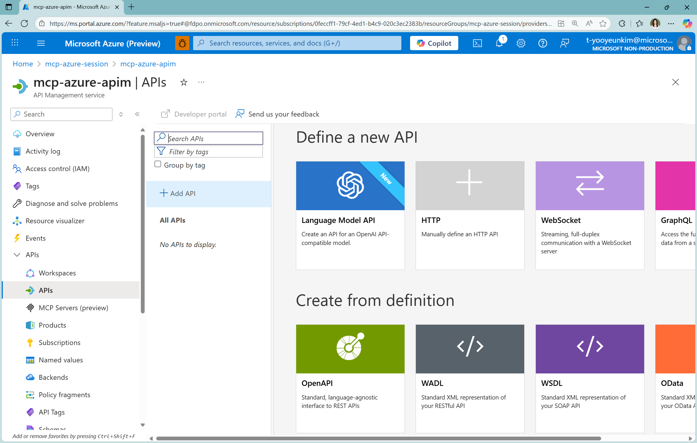
2. Create from OpenAPI specification의 full tab에서 스크린샷과 같이 입력
  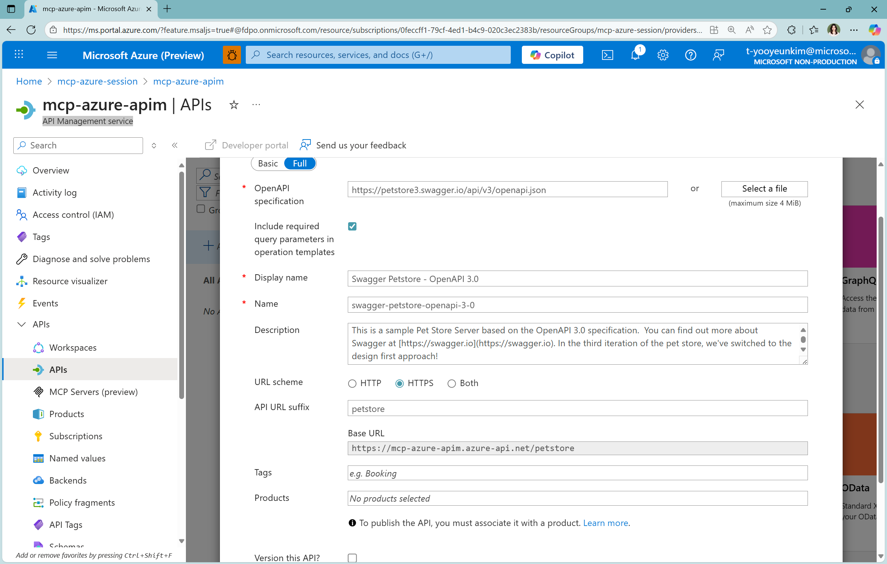
3. Azure Portal에서 API 테스트
  - 탐색 영역에서 APIs > Swagger Petstore 선택 > Test 탭 > Find Pets by Status
  - 사용 가능한 status value (e.g. pending, available, sold) 하나 선택 (쿼리 매개 변수 및 헤더를 추가할 수도 있음)
  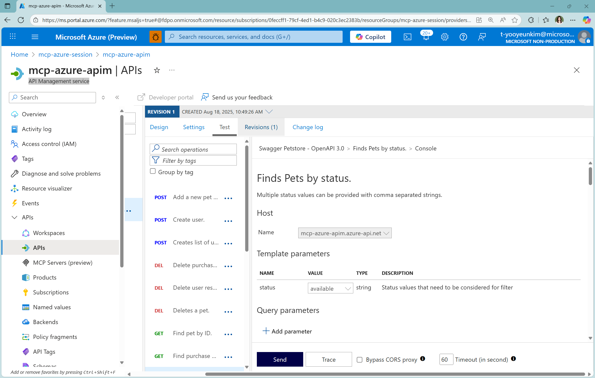
  - Send 버튼 클릭 후 Backend (HTTP response)에서 200 OK 확인
  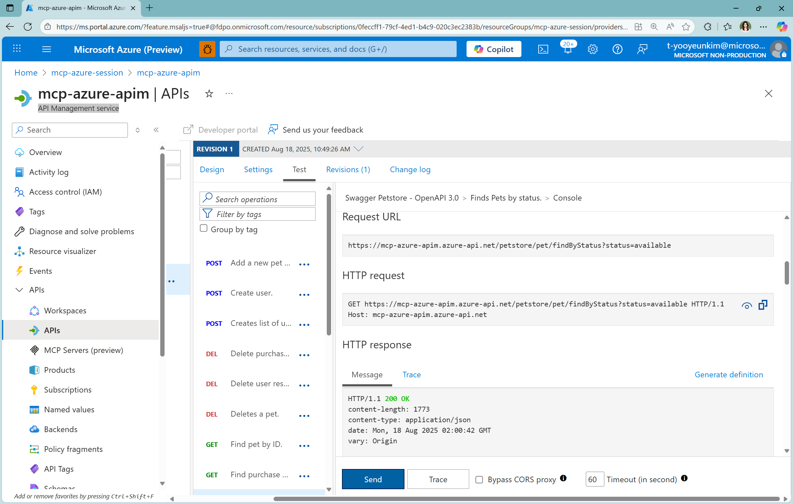

---

## 📡 REST API를 MCP 서버로 노출하기
> 자세한 내용은 [MS Learn: Expose REST API in API Management as an MCP server](https://learn.microsoft.com/en-us/azure/api-management/export-rest-mcp-server) 및 [MS Developer: MCP Dev Days](https://www.youtube.com/live/lHuxDMMkGJ8?si=drLlCScG3v_Lps5S&t=10333)에 제시되어 있습니다.

1. **Azure Portal** 접속 → APIM 인스턴스로 이동

2. 좌측 메뉴 **APIs > MCP Servers > + Create MCP Server** 선택.
  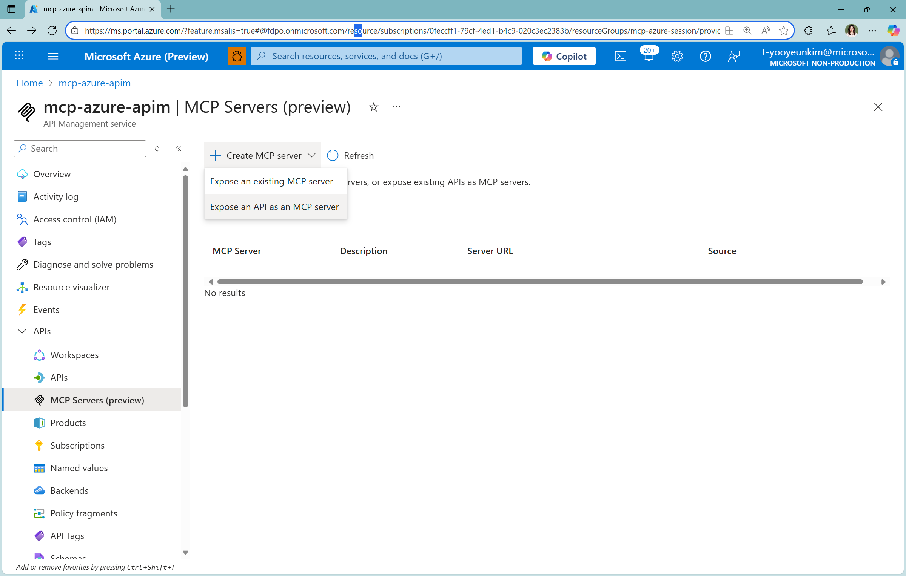

3. **Expose an API as an MCP server** 섹션에서 MCP 서버로 노출할 **REST API** 선택 (Swagger Petstore).

4. MCP **툴로 노출할 API Operation**을 1개 이상 선택 (전부 또는 일부 선택 가능).
  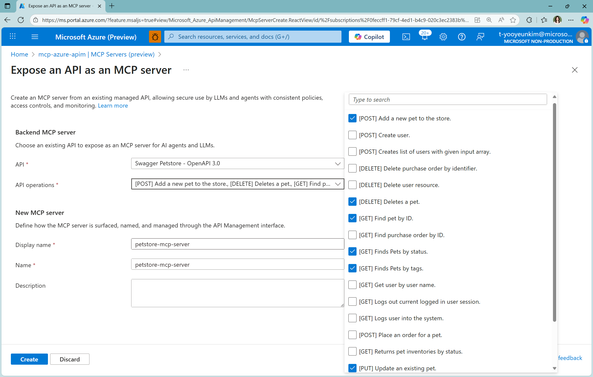

5. 하단의 Name 작성 후 **Create** 클릭.

6. **APIs > MCP Servers**로 이동하면, 생성된 MCP 서버 목록과 **엔드포인트 URL**을 확인할 수 있습니다(테스트/클라이언트에서 호출).
  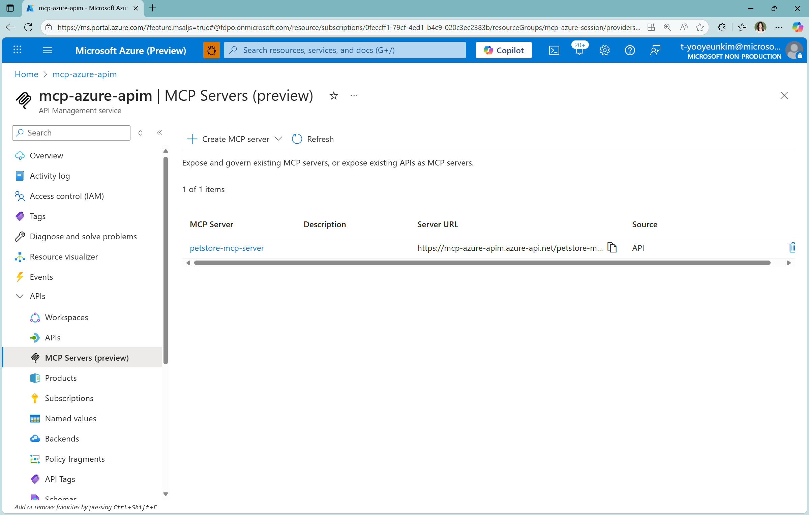

> 🔎 **전송(Transport) 참고:** VS Code 등 MCP 클라이언트는 **SSE** 또는 **Streamable HTTP**를 지원합니다. APIM 문서의 MCP 서버 기능은 최신 **Streamable HTTP**를 기본으로 안내하며, 문서의 예시 URL은 `/sse`(SSE) 또는 `/mcp`(HTTP)처럼 구분됩니다. 실 환경에서는 클라이언트/서버가 동일 전송을 지원하는지 확인하세요.

---

## 🚦 (Optional) 정책 구성: Rate Limiting 예시

APIM 정책은 XML로 작성하며, **요청 제한(rate limit)**, **시맨틱 캐싱**, **토큰 한도** 등 다양한 규칙을 설정할 수 있습니다. 아래는 **클라이언트 IP 기준, 30초에 5회**로 제한하는 예시입니다. 자세한 내용은 [MS Learn: Limit call rate by key](https://learn.microsoft.com/en-us/azure/api-management/rate-limit-by-key-policy)를 참조하세요.

```xml
<rate-limit-by-key 
  calls="5"
  renewal-period="30"
  counter-key="@(context.Request.IpAddress)"
  remaining-calls-variable-name="remainingCallsPerIP"
/>
```

- 정책 편집 경로: **APIs > MCP Servers > 대상 서버(e.g. petstore-mcp-server) > Policies** 에서 XML 편집.


> ⚠️ **스트리밍 주의:** MCP는 스트리밍이 핵심입니다. MCP 서버 정책에서 `context.Response.Body`에 접근하면 **버퍼링이 발생**해 스트리밍이 깨질 수 있으니 피하세요. 또한 App Insights/진단 로깅에서 **응답 바이트 로깅을 0**으로 두는 등, 페이로드 로깅으로 스트림이 방해받지 않도록 설정하세요. ([MS Learn: Expose and govern an existing MCP server](https://learn.microsoft.com/en-us/azure/api-management/expose-existing-mcp-server) 참조.)

---

## ▶️ Try it out: VS Code + Copilot Agent 모드

VS Code에서 MCP 서버를 등록하여 **에이전트 모드**로 툴을 호출해 봅시다. [Use MCP servers in VS Code](https://code.visualstudio.com/docs/copilot/chat/mcp-servers) 참조.

1. **Command Palette** → `MCP: Add Server`.
2. 서버 타입: **HTTP (HTTP or Server Sent Events)** 선택.
3. APIM에 표시된 MCP URL 입력(예):
   * SSE: `https://<apim>.azure-api.net/<api-name>-mcp/sse`
   * HTTP: `https://<apim>.azure-api.net/<api-name>-mcp/mcp`
4. 임의의 **Server ID** 지정. 저장 위치는 **Workspace** 또는 **Global** 중 선택.
   - e.g. Server ID: my-mcp-server-petstore-apim, Global

**mcp.json 설정 예(.vscode/mcp.json):**

```json
{
  "servers": {
    "APIM petstore": {
      "type": "sse",
      "url": "https://<apim>.azure-api.net/<api-name>-mcp/sse"
    }
  }
}
```

**Streamable HTTP 전송 사용 시:**

```json
{
  "servers": {
    "APIM petstore": {
      "type": "http",
      "url": "https://<apim>.azure-api.net/<api-name>-mcp/mcp"
    }
  }
}
```

### 인증 헤더 추가(Ocp-Apim-Subscription-Key)

* VS Code **settings** UI에서 헤더 프롬프트를 추가하거나,
* `mcp.json`에 입력 프롬프트와 헤더를 선언합니다:

```json
{
  "inputs": [
    {
      "type": "promptString",
      "id": "apim_key",
      "description": "API Key for Azure API Management",
      "password": true
    }
  ],
  "servers": {
    "APIM petstore": {
      "type": "http",
      "url": "https://<apim>.azure-api.net/<api-name>-mcp/mcp",
      "headers": {
        "Ocp-Apim-Subscription-Key": "Bearer ${input:apim_key}"
      }
    }
  }
}
```

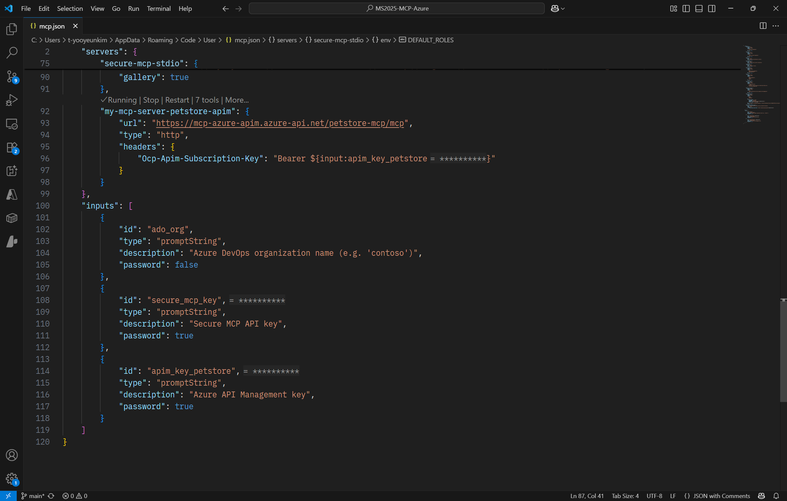

> ✅ **정확한 헤더 사용 팁:** APIM의 **구독 키**는 기본적으로 `Ocp-Apim-Subscription-Key` 헤더에 **키 문자열 그대로** 전달합니다(일반 Bearer 토큰과 다름). JWT를 쓰는 시나리오라면 `Authorization: Bearer <token>` 헤더를 별도로 사용하세요. [MS Learn: Subscriptions in Azure API Management](https://learn.microsoft.com/en-us/azure/api-management/api-management-subscriptions) 참조.

### Agent 모드에서 실행

1. VS Code 좌측 **Tools** 아이콘에서 MCP 서버의 **툴 목록**을 확인 및 선택.
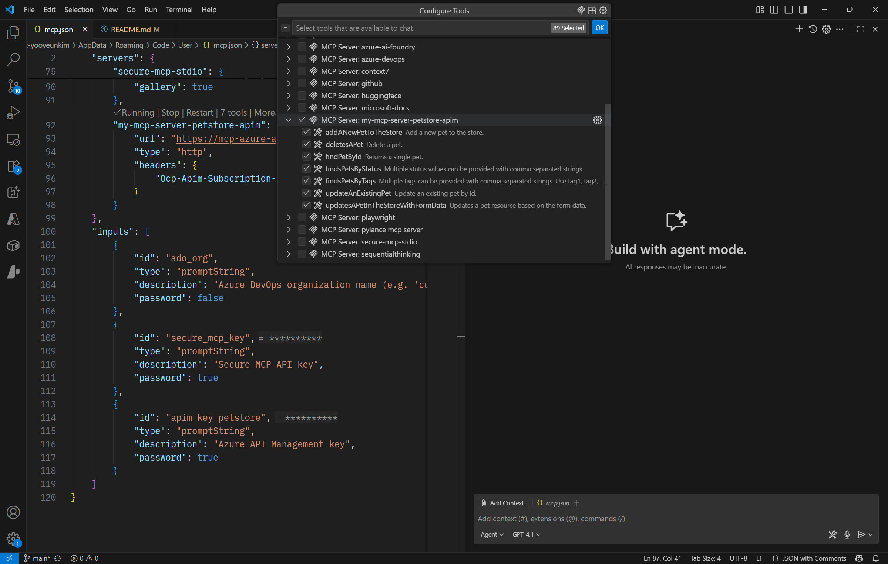
2. 채팅에 프롬프트 입력 → 툴 실행 아이콘을 눌러 호출. 결과는 선택한 툴 구성에 따라 텍스트로 반환됩니다.
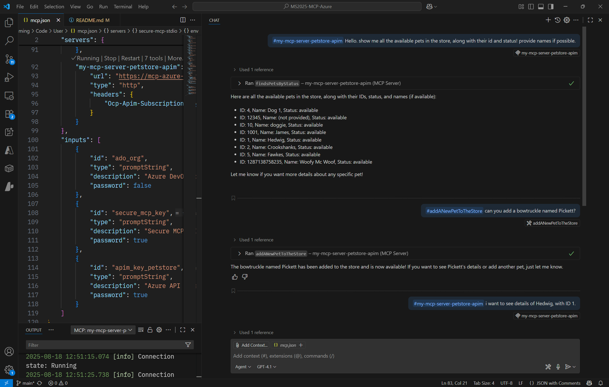
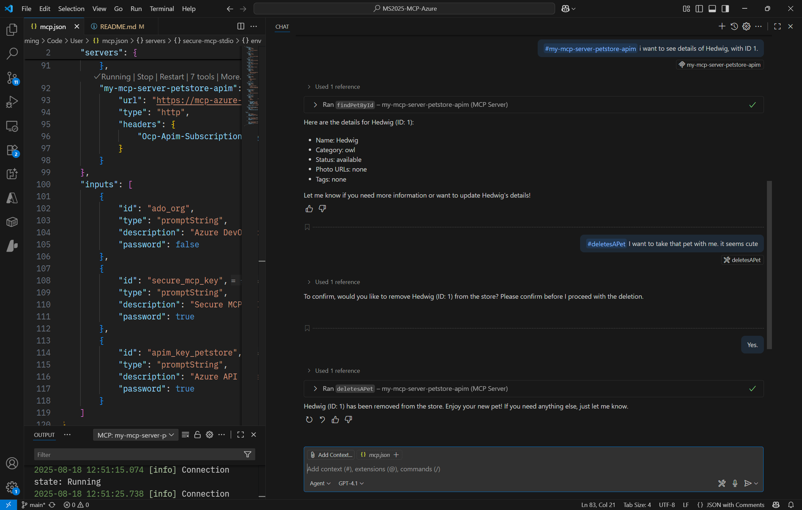

---

## Additional Information: MCP 보안 가이드 & 팁

### 1. 인증/인가(Authorization) — MCP Auth 스펙 정렬

* [**MCP Authorization**](https://modelcontextprotocol.io/specification/draft/basic/authorization)은 **OAuth 2.0 Protected Resource Metadata(PRM, RFC 9728)** 기반입니다. 서버는 PRM 문서를 통해 신뢰하는 \*\*Authorization Server(AS)\*\*를 광고하고, 클라이언트는 이를 따라 표준 플로우로 토큰을 획득합니다. APIM은 이 구조에서 **Auth 게이트웨이**로 동작하기 좋습니다. [How to build secure and scalable remote MCP servers](https://github.blog/ai-and-ml/generative-ai/how-to-build-secure-and-scalable-remote-mcp-servers/) 참조.
* [**MS Learn: Remote MCP using Azure API Management** (Azure Functions, 최신 Auth 스펙 구현)](https://learn.microsoft.com/en-us/samples/azure-samples/remote-mcp-apim-functions-python/remote-mcp-apim-functions-python/)을 참고하면 실제 비즈니스 상황에서의 적용이 수월합니다.

### 2. 키/토큰 취급

* **구독 키 노출 방지:** 인바운드에서 키를 검증하되, 백엔드로는 전달하지 않도록 [`set-header` 정책](https://learn.microsoft.com/en-us/azure/api-management/set-header-policy)으로 **구독 키 헤더 삭제**를 권장합니다. (예: `<set-header name="Ocp-Apim-Subscription-Key" exists-action="delete" />`)
* **시크릿 관리:** APIM [**Named Values**](https://learn.microsoft.com/en-us/azure/api-management/api-management-howto-properties?tabs=azure-portal) + **Key Vault**를 사용해 비밀값을 관리 (회전/권한 분리).

### 3. 전송/스트리밍

* MCP는 **스트리밍 우선**입니다. 정책에서 응답 본문을 버퍼링하지 않도록 주의하고, 진단 로깅의 응답 페이로드 바이트를 0으로 유지하세요.
* SSE/HTTP 전송을 혼용할 경우, **클라이언트·서버 전송 타입 일치**를 먼저 확인하세요. [MS Learn: Expose and govern an existing MCP server](https://learn.microsoft.com/en-us/azure/api-management/expose-existing-mcp-server) 참조.

### 4. AI 게이트웨이 정책

* **시맨틱 캐싱**, **토큰 리밋/모니터링** 정책으로 응답 지연과 비용을 절감하고, 남용을 사전에 차단합니다. [Overview of AI gateway capabilities in Azure API Management](https://learn.microsoft.com/en-us/azure/api-management/genai-gateway-capabilities) 참조. 정책/메트릭/한도 설정 확인 가능.

### 5. VS Code 통합 보안

* VS Code는 `MCP: Add Server`로 손쉽게 서버를 추가하고, 워크스페이스 `.vscode/mcp.json` 또는 전역 `settings.json`에 저장합니다. **신뢰 여부 확인 프롬프트**가 표시되니 서버 구성을 검토 후 승인하세요.

### 6. 엔터프라이즈 거버넌스

* **API Center**에 MCP 서버를 등록/검색하여 **엔터프라이즈 레지스트리**를 구축하면, 조직 내 서버 가시성과 수명주기 관리를 표준화할 수 있습니다. [MS Learn: Register and discover remote MCP servers in your API inventory](https://learn.microsoft.com/en-us/azure/api-center/register-discover-mcp-server) 참조.

---

> 💡 **실습 팁 요약**
>
> * 먼저 APIM에 API를 가져오고, 필요한 오퍼레이션만 **툴로 노출**합니다.
> * **Named Values + Key Vault**로 시크릿을 관리하고, 인바운드에서 구독 키를 검증 후 **백엔드로는 제거**합니다.
> * **rate-limit-by-key**로 클라이언트 IP/토큰/구독 단위 제한을 적용하고, 필요 시 **시맨틱 캐싱/토큰 정책**을 조합합니다.
> * VS Code \*\*`MCP: Add Server`\*\*로 서버 등록 후, **툴 패널**에서 바로 호출/검증합니다.
> * 스트리밍 정책/로깅 설정으로 **응답 버퍼링 금지**를 준수합니다.

---

### Header 구성 예시
- [MS Learn: Subscriptions in Azure API Management](https://learn.microsoft.com/en-us/azure/api-management/api-management-subscriptions) 참조.
* **APIM 구독 키 사용:**
  `Ocp-Apim-Subscription-Key: <your-subscription-key>` (Bearer 접두사 **사용하지 않음**).
* **JWT/Bearer 사용:**
  `Authorization: Bearer <access_token>` (e2e OAuth 사용 시나리오).