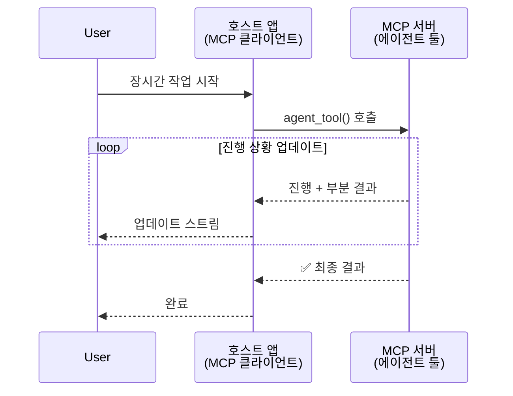
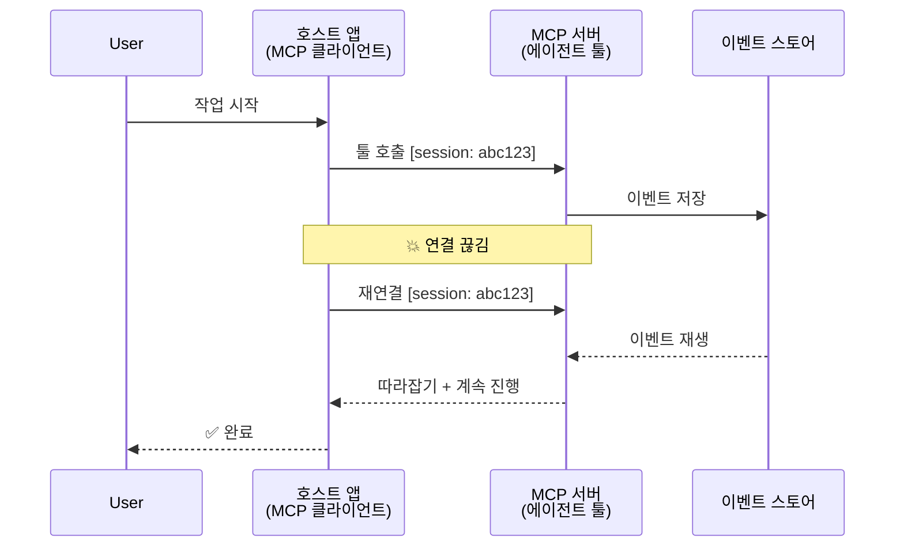
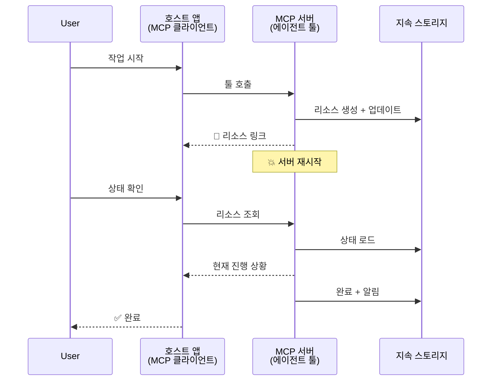
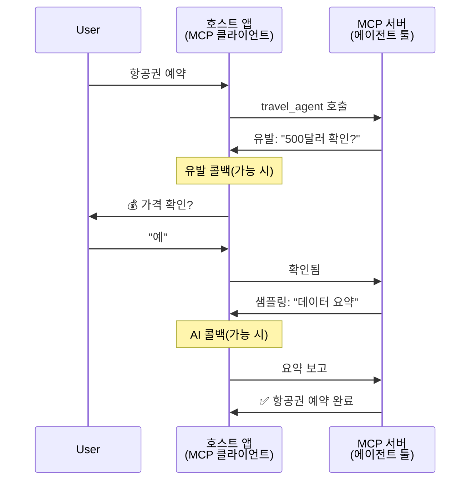
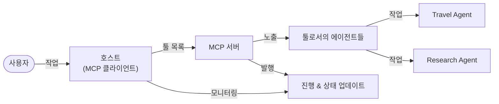
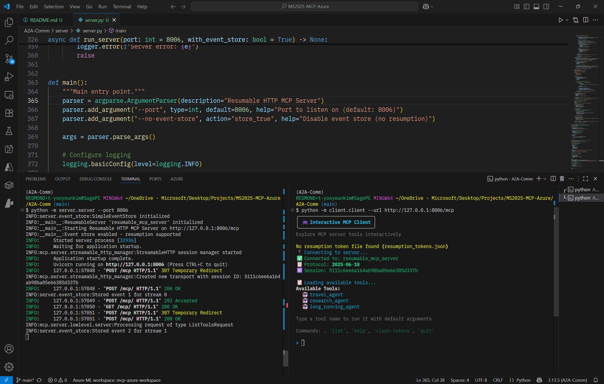
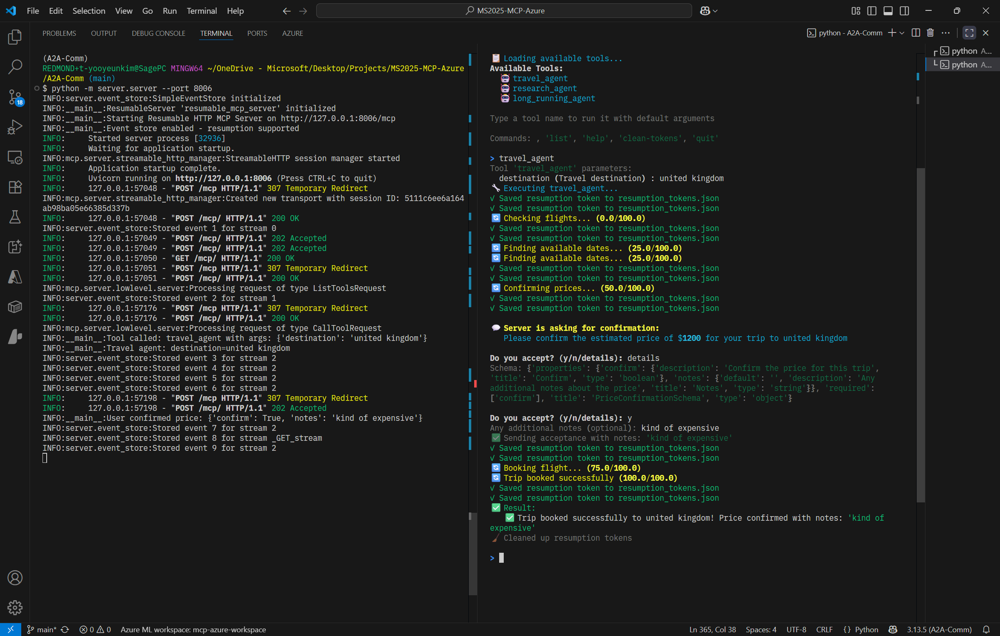
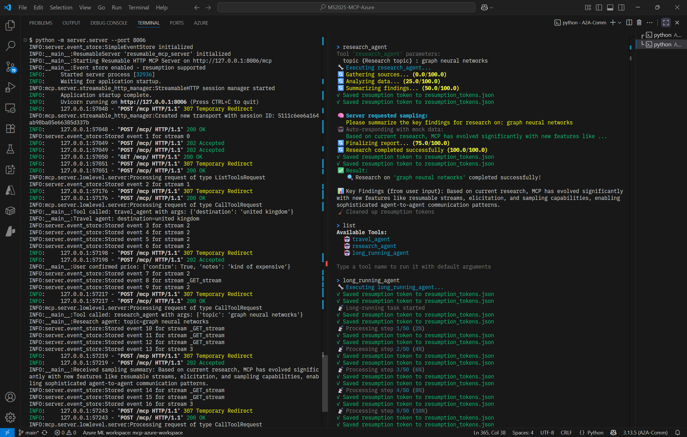
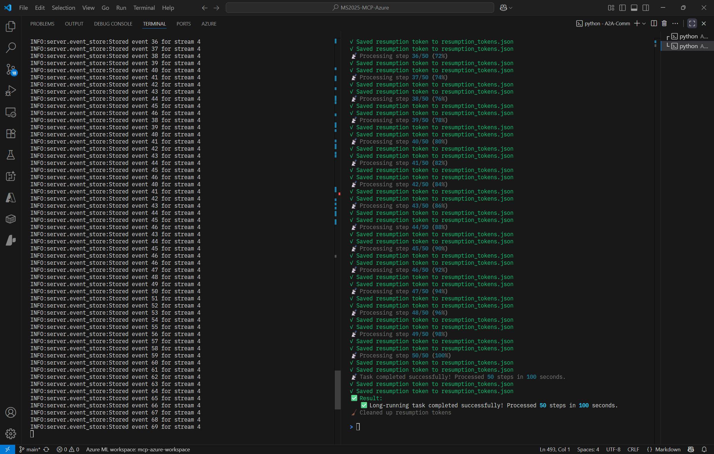

# MCP로 구축하는 에이전트-투-에이전트(Agent-to-Agent) 통신 시스템

> 해당 폴더의 내용 및 파일은 [Microsoft Dev Blogs](https://devblogs.microsoft.com/blog/can-you-build-agent2agent-communication-on-mcp-yes)를 참조하여 작성되었습니다.

MCP는 원래의 목표였던 “LLM에 컨텍스트를 제공”을 훨씬 넘어 크게 발전했습니다. 최근 [재개 가능한 스트림(resumable streams)](https://modelcontextprotocol.io/docs/concepts/transports#resumability-and-redelivery), [유발(elicitation)](https://modelcontextprotocol.io/specification/2025-06-18/client/elicitation), [샘플링(sampling)](https://modelcontextprotocol.io/specification/2025-06-18/client/sampling), 그리고 알림( [진행 상황(progress)](https://modelcontextprotocol.io/specification/2025-06-18/basic/utilities/progress) 및 [리소스](https://modelcontextprotocol.io/specification/2025-06-18/schema#resourceupdatednotification) )이 추가되면서, MCP는 복잡한 에이전트-간 통신 시스템을 구축하기 위한 견고한 기반을 제공하게 되었습니다.

## 에이전트/툴에 대한 오해

오랜 시간 실행되거나 실행 도중 추가 입력이 필요한 등 에이전트적 동작을 하는 툴을 탐구하는 개발자가 늘어나면서, MCP가 부적합하다는 오해가 생겼습니다. 초기의 MCP “툴(tools)” 프리미티브 예제가 단순 요청-응답 패턴에 집중했던 탓이 큽니다.

이 인식은 이제 구식입니다. 지난 몇 달간 MCP 명세는 장시간 실행되는 에이전트적 동작을 구현할 수 있도록 크게 확장되었습니다.

* **스트리밍 & 부분 결과**: 실행 중 실시간 진행 상황 업데이트
* **재개 가능성**: (클라이언트) 연결 끊김 이후 재연결 및 이어서 진행
* **내구성**: 서버 재시작 이후에도 결과가 보존됨(예: 리소스 링크를 통해)
* **멀티 턴**: 유발(elicitation)과 샘플링(sampling)을 통한 실행 중 상호작용 입력

이 기능들을 조합하면 MCP 프로토콜 위에 복잡한 에이전트 및 멀티-에이전트 애플리케이션을 배포할 수 있습니다.

참고로, 여기서는 MCP 서버에서 제공되는 “툴”을 에이전트로 간주합니다. 이는 MCP 서버와 세션을 수립하고 에이전트를 호출할 수 있는 MCP 클라이언트를 구현하는 호스트 애플리케이션이 존재함을 전제합니다.

## MCP 툴을 “에이전트적(Agentic)”으로 만드는 것은 무엇인가?

구현으로 들어가기 전에, 장시간 실행되는 에이전트를 지원하려면 어떤 인프라 기능이 필요한지부터 정리합니다.

> 우리는 에이전트를, 장기간 자율적으로 동작할 수 있으며, 실시간 피드백에 기반해 여러 번의 상호작용이나 조정이 필요할 수 있는 복잡한 과업을 처리할 수 있는 엔터티로 정의합니다.

### 1. 스트리밍 & 부분 결과

전통적인 요청-응답 패턴은 장시간 작업에 적합하지 않습니다. 에이전트는 다음을 제공해야 합니다.

* 실시간 진행 상황 업데이트
* 중간(부분) 결과

**MCP 지원**: 리소스 업데이트 알림은 부분 결과 스트리밍을 가능하게 합니다. 다만 JSON-RPC의 1:1 요청/응답 모델과 충돌하지 않도록 신중한 설계가 필요합니다.

| 기능             | 사용 사례                                                                                                     | MCP 지원                                           |
| -------------- | --------------------------------------------------------------------------------------------------------- | ------------------------------------------------ |
| 실시간 진행 상황 업데이트 | 사용자가 코드베이스 마이그레이션을 요청. 에이전트가 “10% - 의존성 분석… 25% - TypeScript 파일 변환… 50% - import 업데이트…”와 같이 진행률을 스트림으로 전송 | ✅ 진행(progress) 알림                                |
| 부분 결과          | “책 생성” 작업에서 1) 스토리 아크 개요, 2) 챕터 리스트, 3) 각 챕터 완성본을 순차적으로 스트리밍. 호스트는 각 단계에서 검사/취소/재지시 가능                    | ✅ 알림을 “확장”하여 부분 결과를 포함 가능( PR #383, #776 제안 참고 ) |

<div align="center" style="font-style: italic; font-size: 0.95em; margin-bottom: 0.5em;">
<strong>그림 1:</strong> 이 다이어그램은 MCP 에이전트가 장시간 작업 동안 호스트 애플리케이션에 실시간 진행 상황과 부분 결과를 스트리밍하여 사용자가 실행을 실시간으로 모니터링할 수 있게 하는 방식을 보여줍니다.
</div>



### 2. 재개 가능성(Resumability)

에이전트는 네트워크 중단을 우아하게 처리해야 합니다.

* (클라이언트) 연결 끊김 이후 재연결
* 끊겼던 지점부터 계속 진행(메시지 재전달)

**MCP 지원**: MCP StreamableHTTP 트랜스포트는 세션 ID와 마지막 이벤트 ID를 통해 세션 재개와 메시지 재전달을 지원합니다. 중요한 점은 서버가 클라이언트 재연결 시 이벤트 재생(replay)을 가능하게 하는 EventStore를 구현해야 한다는 것입니다.
트랜스포트에 구애받지 않는 재개 가능한 스트림을 탐색하는 커뮤니티 제안(PR #975)도 있습니다.

| 기능     | 사용 사례                                                        | MCP 지원                                               |
| ------ | ------------------------------------------------------------ | ---------------------------------------------------- |
| 재개 가능성 | 장시간 작업 도중 클라이언트가 끊김. 재연결 시 누락된 이벤트를 재생하여 중단 지점부터 매끄럽게 이어서 진행 | ✅ 세션 ID, 이벤트 재생, EventStore를 갖춘 StreamableHTTP 트랜스포트 |

<div align="center" style="font-style: italic; font-size: 0.95em; margin-bottom: 0.5em;">
<strong>그림 2:</strong> MCP의 StreamableHTTP 트랜스포트와 이벤트 스토어가 어떻게 원활한 세션 재개를 가능하게 하는지 보여줍니다. 클라이언트가 끊기면 재연결하여 누락된 이벤트를 재생하고 손실 없이 작업을 계속합니다.
</div>



### 3. 내구성(Durability)

장시간 에이전트에는 지속 상태가 필요합니다.

* 서버 재시작 후에도 결과가 보존
* 대역 외(out-of-band) 상태 조회 가능
* 세션 간 진행 상황 추적

**MCP 지원**: MCP는 이제 툴 호출 결과로 리소스 링크(Resource link)를 반환하는 것을 지원합니다. 오늘 사용 가능한 패턴 중 하나는, 리소스를 생성하고 즉시 리소스 링크를 반환하는 툴을 설계하는 것입니다. 툴은 백그라운드에서 작업을 계속 처리하며 리소스를 갱신할 수 있습니다. 그에 따라 클라이언트는 (서버가 제공하는 리소스 업데이트에 기반하여) 부분/전체 결과를 얻기 위해 해당 리소스의 상태를 폴링하거나, 리소스 업데이트 알림 구독을 선택할 수 있습니다.

제한 사항으로, 리소스 폴링 또는 업데이트 구독은 리소스를 소비하며 대규모에서 비용이 들 수 있습니다. 서버가 클라이언트/호스트 애플리케이션에 업데이트를 알리기 위해 호출할 수 있는 웹훅이나 트리거 포함 가능성을 탐구하는 커뮤니티 제안(#992 포함)이 열려 있습니다.

| 기능  | 사용 사례                                                                              | MCP 지원                      |
| --- | ---------------------------------------------------------------------------------- | --------------------------- |
| 내구성 | 데이터 마이그레이션 작업 중 서버 충돌. 결과와 진행 상황은 재시작 후에도 보존되며, 클라이언트는 상태를 확인하고 지속 리소스에서 이어서 진행 가능 | ✅ 지속 스토리지와 상태 알림을 갖춘 리소스 링크 |

오늘날 흔한 패턴은, 리소스를 생성하고 즉시 리소스 링크를 반환하는 툴을 설계하는 것입니다. 툴은 백그라운드에서 작업을 처리하며, 진행 상황 업데이트로서 리소스 알림을 발행하거나 부분 결과를 포함시키고, 필요에 따라 리소스의 콘텐츠를 갱신합니다.

<div align="center" style="font-style: italic; font-size: 0.95em; margin-bottom: 0.5em;">
<strong>그림 3:</strong> 이 다이어그램은 MCP 에이전트가 지속 리소스와 상태 알림을 사용해 장시간 작업이 서버 재시작 후에도 생존하도록 하여, 실패 이후에도 클라이언트가 진행 상황을 확인하고 결과를 가져올 수 있게 하는 방식을 보여줍니다.
</div>



### 4. 멀티 턴 상호작용

에이전트는 실행 도중 추가 입력이 필요할 때가 많습니다.

* 사람의 명확화/승인
* 복잡한 의사결정을 위한 AI 지원
* 동적 파라미터 조정

**MCP 지원**: 샘플링( AI 입력 )과 유발( 사람 입력 )로 완전히 지원됩니다.

| 기능        | 사용 사례                                                      | MCP 지원                                         |
| --------- | ---------------------------------------------------------- | ---------------------------------------------- |
| 멀티 턴 상호작용 | 여행 예약 에이전트가 사용자에게 가격 확인을 요청한 뒤, 예약 완료 전에 AI에 여행 데이터 요약을 요청 | ✅ 사람 입력은 유발(elicitation), AI 입력은 샘플링(sampling) |

<div align="center" style="font-style: italic; font-size: 0.95em; margin-bottom: 0.5em;">
<strong>그림 4:</strong> 이 다이어그램은 MCP 에이전트가 실행 중에 사람의 입력을 상호작용적으로 유발하거나 AI 지원을 요청해, 확인 및 동적 의사결정 같은 복잡한 멀티 턴 워크플로를 지원하는 방식을 보여줍니다.
</div>



## MCP에서 장시간 에이전트 구현 – 코드 개요

이 글과 함께 [코드 저장소](https://github.com/victordibia/ai-tutorials/tree/main/MCP%20Agents)를 제공합니다. 여기에는 MCP Python SDK와 StreamableHTTP 트랜스포트를 사용해 세션 재개와 메시지 재전달을 구현한 장시간 에이전트의 완전한 예제가 들어 있습니다. 구현은 MCP 기능들을 조합하여 정교한 에이전트형 동작을 가능하게 하는 방법을 보여줍니다.

구체적으로, 서버에는 두 개의 주요 에이전트 툴이 구현되어 있습니다.

* **Travel Agent** – 유발(elicitation)을 통한 가격 확인이 포함된 여행 예약 서비스 시뮬레이션
* **Research Agent** – 샘플링(sampling)을 통한 AI 보조 요약이 포함된 리서치 작업

두 에이전트 모두 실시간 진행 업데이트, 상호작용적 확인, 완전한 세션 재개 기능을 시연합니다.

### 핵심 구현 개념

아래 섹션들은 각 기능에 대해 서버-사이드 에이전트 구현과 클라이언트-사이드 호스트 처리 방법을 보여줍니다.

#### 스트리밍 & 진행 업데이트 – 실시간 작업 상태

스트리밍은 에이전트가 장시간 작업 중 실시간 진행 상황을 제공하여 사용자가 상태와 중간 결과를 파악할 수 있게 해줍니다.

**서버 구현(에이전트가 진행 알림 전송):**

```python
# server/server.py 발췌 - Travel agent가 진행 상황 업데이트 전송
for i, step in enumerate(steps):
    await ctx.session.send_progress_notification(
        progress_token=ctx.request_id,
        progress=i * 25,
        total=100,
        message=step,
        related_request_id=str(ctx.request_id)
    )
    await anyio.sleep(2)  # 작업 시뮬레이션

# 대안: 단계별 상세 업데이트를 위한 로그 메시지
await ctx.session.send_log_message(
    level="info",
    data=f"Processing step {current_step}/{steps} ({progress_percent}%)",
    logger="long_running_agent",
    related_request_id=ctx.request_id,
)
```

**클라이언트 구현(호스트가 실시간 알림 수신):**

```python
# client/client.py 발췌 - 클라이언트가 실시간 알림 처리
async def message_handler(message) -> None:
    if isinstance(message, types.ServerNotification):
        if isinstance(message.root, types.LoggingMessageNotification):
            console.print(f"📡 [dim]{message.root.params.data}[/dim]")
        elif isinstance(message.root, types.ProgressNotification):
            progress = message.root.params
            console.print(f"🔄 [yellow]{progress.message} ({progress.progress}/{progress.total})[/yellow]")

# 세션 생성 시 핸들러 등록
async with ClientSession(
    read_stream, write_stream,
    message_handler=message_handler
) as session:
```

#### 유발(Elicitation) – 사용자 입력 요청

유발은 에이전트가 실행 도중 사용자 입력을 요청할 수 있게 합니다. 이는 장시간 작업에서 확인, 명확화, 승인 등에 필수적입니다.

**서버 구현(에이전트가 확인 요청):**

```python
# server/server.py 발췌 - Travel agent가 가격 확인 요청
elicit_result = await ctx.session.elicit(
    message=f"Please confirm the estimated price of $1200 for your trip to {destination}",
    requestedSchema=PriceConfirmationSchema.model_json_schema(),
    related_request_id=ctx.request_id,
)

if elicit_result and elicit_result.action == "accept":
    # 예약 계속 진행
    logger.info(f"User confirmed price: {elicit_result.content}")
elif elicit_result and elicit_result.action == "decline":
    # 예약 취소
    booking_cancelled = True
```

**클라이언트 구현(호스트가 유발 콜백 제공):**

```python
# client/client.py 발췌 - 클라이언트가 유발 요청 처리
async def elicitation_callback(context, params):
    console.print(f"💬 서버가 확인을 요청합니다:")
    console.print(f"   {params.message}")

    response = console.input("수락하시겠습니까? (y/n): ").strip().lower()

    if response in ['y', 'yes']:
        return types.ElicitResult(
            action="accept",
            content={"confirm": True, "notes": "사용자가 확인함"}
        )
    else:
        return types.ElicitResult(
            action="decline",
            content={"confirm": False, "notes": "사용자가 거부함"}
        )

# 세션 생성 시 콜백 등록
async with ClientSession(
    read_stream, write_stream,
    elicitation_callback=elicitation_callback
) as session:
```

#### 샘플링(Sampling) – AI 지원 요청

샘플링은 실행 중 복잡한 의사결정이나 콘텐츠 생성에 LLM의 도움을 요청할 수 있게 합니다. 이는 사람-AI 하이브리드 워크플로를 가능하게 합니다.

**서버 구현(에이전트가 AI 지원 요청):**

```python
# server/server.py 발췌 - Research agent가 AI 요약을 요청
sampling_result = await ctx.session.create_message(
    messages=[
        SamplingMessage(
            role="user",
            content=TextContent(type="text", text=f"Please summarize the key findings for research on: {topic}")
        )
    ],
    max_tokens=100,
    related_request_id=ctx.request_id,
)

if sampling_result and sampling_result.content:
    if sampling_result.content.type == "text":
        sampling_summary = sampling_result.content.text
        logger.info(f"Received sampling summary: {sampling_summary}")
```

**클라이언트 구현(호스트가 샘플링 콜백 제공):**

```python
# client/client.py 발췌 - 클라이언트가 샘플링 요청 처리
async def sampling_callback(context, params):
    message_text = params.messages[0].content.text if params.messages else 'No message'
    console.print(f"🧠 서버가 샘플링을 요청했습니다: {message_text}")

    # 실제 애플리케이션에서는 여기서 LLM API를 호출할 수 있습니다.
    # 데모를 위해 모의 응답을 제공합니다.
    mock_response = "Based on current research, MCP has evolved significantly..."

    return types.CreateMessageResult(
        role="assistant",
        content=types.TextContent(type="text", text=mock_response),
        model="interactive-client",
        stopReason="endTurn"
    )

# 세션 생성 시 콜백 등록
async with ClientSession(
    read_stream, write_stream,
    sampling_callback=sampling_callback,
    elicitation_callback=elicitation_callback
) as session:
```

#### 재개 가능성 – 연결 끊김을 넘어서는 세션 연속성

재개 가능성은 클라이언트 연결이 끊겨도 장시간 작업이 계속 진행되며, 재연결 시 매끄럽게 이어지도록 보장합니다. 이는 이벤트 스토어와 재개 토큰으로 구현됩니다.

**이벤트 스토어 구현(서버가 세션 상태 보유):**

```python
# server/event_store.py 발췌 - 단순 인메모리 이벤트 스토어
class SimpleEventStore(EventStore):
    def __init__(self):
        self._events: list[tuple[StreamId, EventId, JSONRPCMessage]] = []
        self._event_id_counter = 0

    async def store_event(self, stream_id: StreamId, message: JSONRPCMessage) -> EventId:
        """이벤트를 저장하고 그 ID를 반환합니다."""
        self._event_id_counter += 1
        event_id = str(self._event_id_counter)
        self._events.append((stream_id, event_id, message))
        return event_id

    async def replay_events_after(self, last_event_id: EventId, send_callback: EventCallback) -> StreamId | None:
        """지정한 ID 이후의 이벤트를 재생(리플레이)합니다."""
        # 마지막으로 알려진 이벤트 이후의 이벤트들을 찾아 재생
        for _, event_id, message in self._events[start_index:]:
            await send_callback(EventMessage(message, event_id))

# server/server.py 발췌 - 세션 매니저에 이벤트 스토어 전달
def create_server_app(event_store: Optional[EventStore] = None) -> Starlette:
    server = ResumableServer()

    # 이벤트 스토어를 가진 세션 매니저 생성(재개 가능)
    session_manager = StreamableHTTPSessionManager(
        app=server,
        event_store=event_store,  # 세션 재개를 가능하게 하는 이벤트 스토어
        json_response=False,
        security_settings=security_settings,
    )

    return Starlette(routes=[Mount("/mcp", app=session_manager.handle_request)])

# 사용: 이벤트 스토어와 함께 초기화
event_store = SimpleEventStore()
app = create_server_app(event_store)
```

**재개 토큰을 사용하는 클라이언트 메타데이터(저장된 상태로 재연결):**

```python
# client/client.py 발췌 - 클라이언트가 메타데이터로 재개
if existing_tokens and existing_tokens.get("resumption_token"):
    # 기존 재개 토큰을 사용해 이전 지점부터 이어서 진행
    metadata = ClientMessageMetadata(
        resumption_token=existing_tokens["resumption_token"],
    )
else:
    # 재개 토큰을 수신하면 저장하도록 콜백 설정
    def enhanced_callback(token: str):
        protocol_version = getattr(session, 'protocol_version', None)
        token_manager.save_tokens(session_id, token, protocol_version, command, args)

    metadata = ClientMessageMetadata(
        on_resumption_token_update=enhanced_callback,
    )

# 재개 메타데이터와 함께 요청 전송
result = await session.send_request(
    types.ClientRequest(
        types.CallToolRequest(
            method="tools/call",
            params=types.CallToolRequestParams(name=command, arguments=args)
        )
    ),
    types.CallToolResult,
    metadata=metadata,
)
```

호스트 애플리케이션은 세션 ID와 재개 토큰을 로컬에 유지하여, 진행 상황이나 상태를 잃지 않고 기존 세션으로 재연결할 수 있습니다.

### 코드 구성

<div align="center" style="font-style: italic; font-size: 0.95em; margin-bottom: 0.5em;">
<strong>그림 5:</strong> MCP 기반 에이전트 시스템 아키텍처
</div>



**주요 파일:**

* **`server/server.py`** – 유발, 샘플링, 진행 업데이트를 시연하는 여행/리서치 에이전트를 갖춘 재개 가능한 MCP 서버
* **`client/client.py`** – 재개 지원, 콜백 핸들러, 토큰 관리를 포함한 인터랙티브 호스트 애플리케이션
* **`server/event_store.py`** – 세션 재개와 메시지 재전달을 가능케 하는 이벤트 스토어 구현

## MCP에서 멀티-에이전트 통신으로 확장

위 구현은 호스트 애플리케이션의 지능과 범위를 확장함으로써 멀티-에이전트 시스템으로 확장할 수 있습니다.

* **지능형 작업 분해**: 호스트가 복잡한 사용자 요청을 분석해 전문화된 여러 에이전트의 하위 작업으로 분할
* **멀티 서버 코디네이션**: 서로 다른 에이전트 능력을 노출하는 복수의 MCP 서버에 대한 연결 유지
* **작업 상태 관리**: 다수의 동시 에이전트 작업 전반에 걸친 진행 상황을 추적하고, 의존성과 순서를 처리
* **회복력 & 재시도**: 실패를 관리하고 재시도 로직을 구현하며, 에이전트 이용 불가 시 작업 재라우팅
* **결과 합성**: 여러 에이전트의 출력을 결합해 일관된 최종 결과 생성

호스트는 단순한 클라이언트에서, 분산된 에이전트 능력을 조정하는 지능형 오케스트레이터로 진화합니다. 그동안 MCP 프로토콜 기반은 그대로 유지됩니다.

## 결론

리소스 알림, 유발/샘플링, 재개 가능한 스트림, 지속 리소스 등 MCP의 향상된 기능은 프로토콜의 단순성을 유지하면서도 복잡한 에이전트-간 상호작용을 가능하게 합니다.

## 시작하기

직접 agent-to-agent 시스템을 만들어 볼 준비가 되셨나요? 다음 단계를 따라 해보세요.

### 1. 데모 실행

```bash
# 재개를 위한 이벤트 스토어와 함께 서버 시작
python -m server.server --port 8006

# 다른 터미널에서 인터랙티브 클라이언트 실행
python -m client.client --url http://127.0.0.1:8006/mcp
```


**인터랙티브 모드에서 사용 가능한 명령:**

* `travel_agent` - 유발을 통한 가격 확인이 포함된 여행 예약
* `research_agent` - 샘플링을 통한 AI 보조 요약과 함께 주제 리서치
* `list` - 사용 가능한 모든 툴 나열
* `clean-tokens` - 재개 토큰 초기화
* `help` - 자세한 명령 도움말
* `quit` - 클라이언트 종료

#### Agent 사용 관련 예시
* travel agent

* research agent

* long running agent

### 2. 재개 기능 테스트

* 장시간 에이전트 시작(예: `travel_agent`)
* 실행 도중 클라이언트를 중단(Ctrl+C)
* 클라이언트를 재시작 – 이전 지점부터 자동으로 재개됩니다

### 3. 탐색 및 확장

* **예제 탐색**: [mcp-agents](https://github.com/victordibia/ai-tutorials/tree/main/MCP%20Agents)를 확인하세요
* **커뮤니티 참여**: GitHub의 MCP 토론에 참여하세요
* **실험**: 단순한 장시간 작업부터 시작해 스트리밍, 재개, 멀티-에이전트 오케스트레이션을 점진적으로 추가해 보세요

이는 MCP가 툴 기반의 단순성을 유지하면서도 지능형 에이전트 동작을 가능케 함을 보여줍니다.

전반적으로 MCP 프로토콜 명세는 빠르게 진화하고 있습니다. 최신 업데이트는 [MCP 공식 문서 웹사이트](https://modelcontextprotocol.io/introduction)에서 확인하시기 바랍니다.
