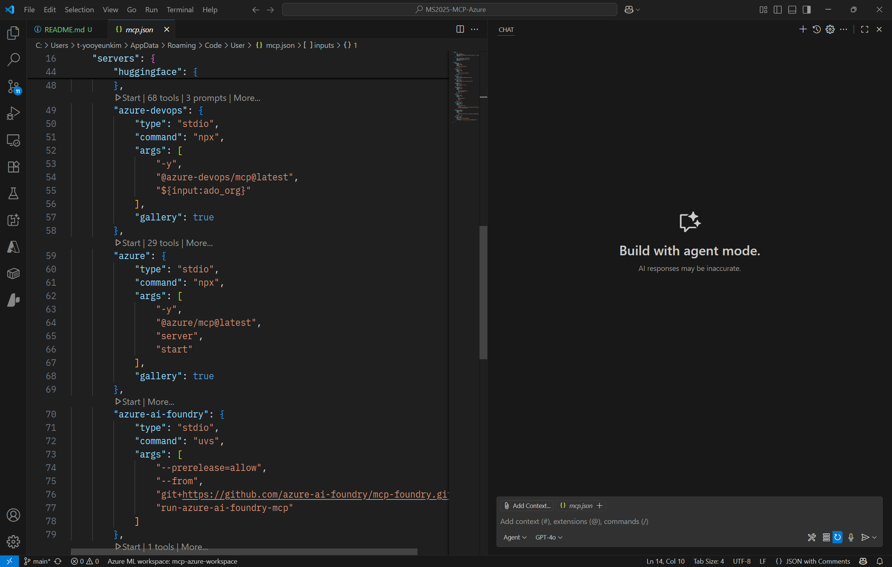
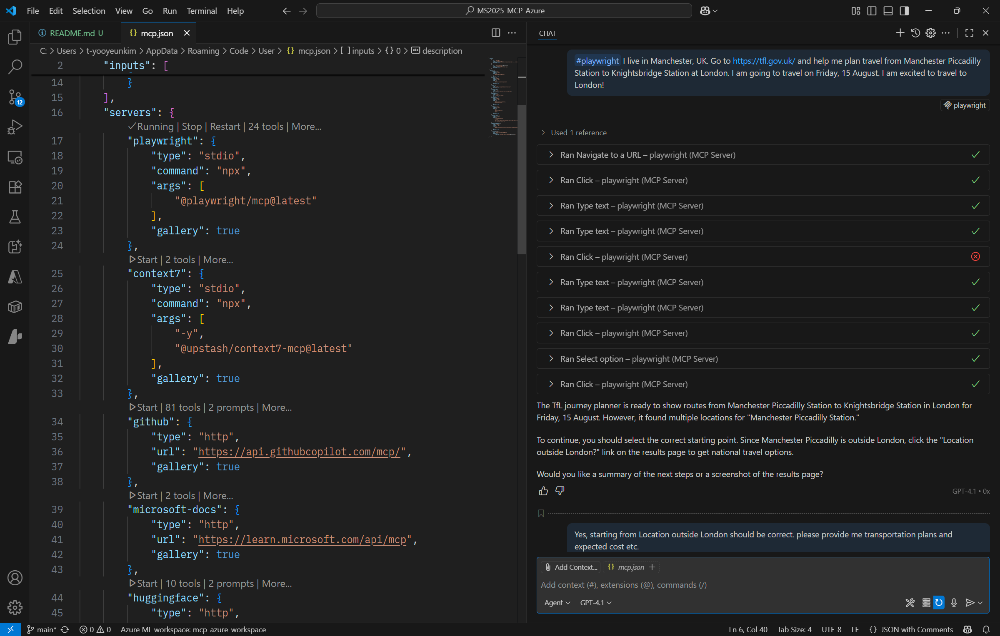
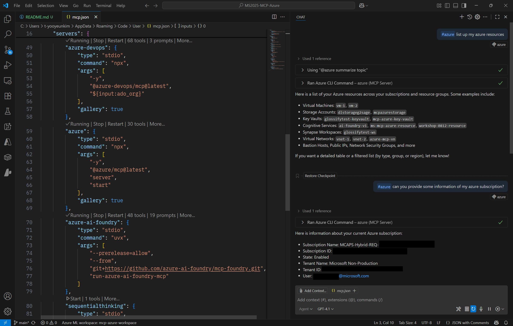
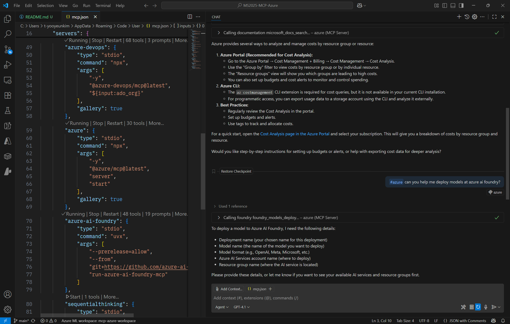
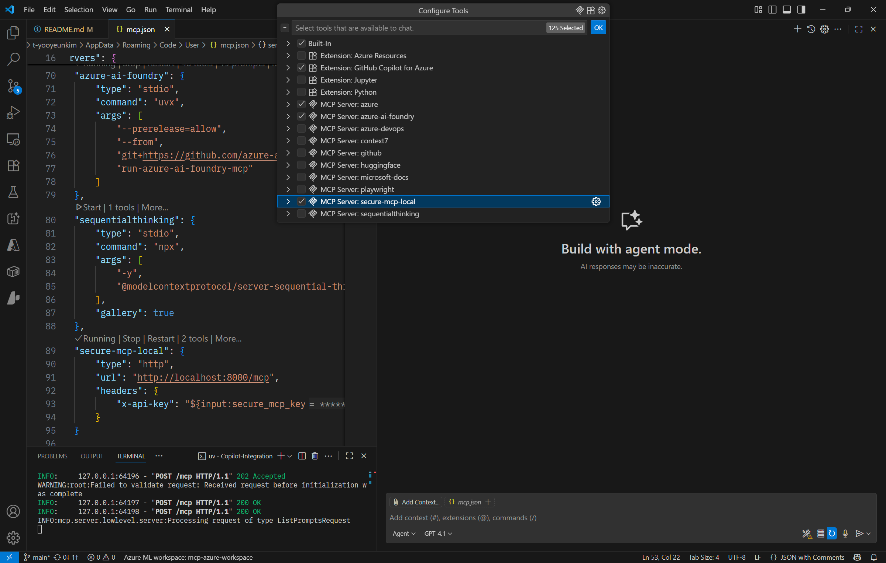
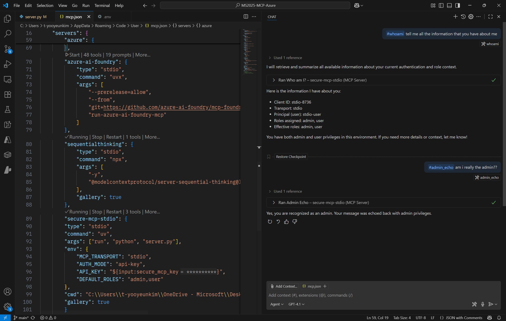

# VS Code Copilot: MCP Client

## 🎯 학습 목표

* GitHub Copilot을 **MCP 클라이언트**로 사용하여 VS Code에서 MCP 서버들을 연결하고 **Agent 모드**로 대화/툴 호출을 체험한다.
* 공개 MCP 서버(Playwright, Azure MCP, Azure AI Foundry MCP)를 실행·연결하고 **실전 프롬프트 예시**로 동작을 검증한다.
* **Azure AI Content Safety – Prompt Shields**를 사용해 \*\*간접 프롬프트 인젝션(XPIA)\*\*을 탐지·차단하는 **커스텀 MCP 서버**를 이해하고 실행한다.
* 툴 단위 **RBAC**를 적용하고 API 키 기반 인증(데모)을 거쳐 **Copilot Agent**에서 안전하게 사용한다.

---

## ✅ Prerequisites
- VS Code 최신 버전
- GitHub Copilot Chat 사용 가능 계정 (Agent 모드 지원)
- VS Code의 MCP 구성 사용 환경 (설정은 아래 단계에서 안내
- Playwright / Azure / Azure AI Foundry MCP 서버 설치
  - 설치는 각 리포지토리의 README를 따르거나, VS Code MCP 설정 화면의 Install 버튼을 이용해도 됩니다.
  - [Azure MCP GitHub Repo](https://github.com/Azure/azure-mcp)
  - [Azure AI Foundry MCP GitHub Repo](https://github.com/azure-ai-foundry/mcp-foundry)
> ⚠️ Copilot의 MCP 활성 Tool 수는 128개 이하로 유지하세요. 불필요한 서버/툴은 끄거나 선택 해제합니다.
-  **Python 3.10+** 및 [uv](https://github.com/astral-sh/uv) (권장)
* Azure 구독 & Azure AI Foundry 워크스페이스

---

## 1. GitHub Copilot을 MCP 클라이언트로 사용하기

### 1-1. VS Code에서 MCP 설정 파일 열기

1. **mcp user configuration 파일** 열기
  - VS Code → Command Palette → “MCP” 검색 → Open MCP configuration
  - `mcp.json`에 설치된 MCP 서버 항목을 확인합니다.


2. **Copilot Chat**에서 **Agent 모드** 활성화
  - 좌측 Copilot Chat 패널 열기
  - 상단 토글에서 Agent 모드로 전환 (Tools 활성화 목록이 보입니다)


---

## 2. MCP 서버 사용 실습

### Common Flow

* VS Code 좌측 **MCP** 패널에서 각 서버를 **Run**
* **Running** 상태 확인 후 Copilot Chat의 **Agent 모드**에서 해당 서버 **Tools** 활성화
* 프롬프트 예시로 동작 검증

> **참고**: 아래 예시들은 **tool ≤ 128개**를 유지하며 진행하세요.

---

### 2-1. Playwright MCP

* **Playwright MCP**는 브라우저 자동화로 웹 탐색/스크린샷/DOM 상호작용 등을 수행하는 MCP 서버입니다.
* 웹사이트 탐색 후 **여행 경로/표 편성/데이터 추출**처럼 브라우저 활동을 자동화합니다.

- 프롬프트 예시:
  ```
  I live in Manchester, UK. Go to [https://tfl.gov.uk/](https://tfl.gov.uk/) and help me plan travel from Manchester Piccadilly Station to Knightsbridge Station at London. I am going to travel on Friday, 15 August. I am excited to travel to London!
  ```

- 실행 & 채팅 예시:



---

### 2-2. Azure MCP

* [Azure MCP GitHub Repository](https://github.com/Azure/azure-mcp)
* 구독/리소스 조회, 비용 관련 힌트, 배포 보조 등 Azure 리소스 관리에 필요한 도구를 제공합니다. (실제 구독 권한이 필요합니다.)

- 프롬프트 예시(구독/리소스):
  ```
  list up my azure resources
  can you provide some information of my azure subscription?
  ```
  

  - 프롬프트 예시(운영/비용/배포):
  ```
  What resource groups, or resources of my subscription are leading to a high cost? I need some management.
  can you help me deploy models at azure ai foundry?
  ```
  

---

### 2-3. Azure AI Foundry MCP

* [Azure AI Foundry MCP GitHub Repository](https://github.com/azure-ai-foundry/mcp-foundry)
* 모델 카탈로그/배포/엔드포인트 관리 등 Azure AI Foundry 연동 도구를 제공합니다.
* 일부 기능은 **.env 설정** 필요(Repository 문서 참고)
  * .env 가이드 스크린샷 (created with foundry mcp)
  

- 프롬프트 예시(모델 추천/지역 제약/배포):
  ```
  What models are good for reasoning? Show me some examples in two buckets, one for large models and one for small models. Explain why.
  from these, what can i currently use if i am in the korea central region?
  i need specific deployment instructions and your help in deploying Llama 4 Scout 17B
  ```
  
  

---

### 🔧 Quick Troubleshooting
- Tools가 너무 많아 로드 실패/지연: 사용 서버/툴을 줄여 128개 이하로 유지
- Azure 인증 실패: 올바른 로그인/구독 컨텍스트인지, 권한이 충분한지 확인
- Foundry .env 오류: 키/엔드포인트/구독/리소스 그룹/프로젝트 이름이 정확한지 재검증

---

## 3. **Prompt Shields 적용 커스텀 MCP 서버** (Security Demo)

### 3-1 개요

* 파일: **`server.py`**
* 목적:
  * **Azure AI Content Safety – Prompt Shields**로 XPIA(간접 프롬프트 인젝션) **사전 탐지/차단** 실습입니다.
  * **Streamable HTTP(ASGI)** 엔드포인트(`/mcp`) 제공 → VS Code **Copilot Agent**에서 연결하여 RBAC + 보안 필터링 동작을 확인합니다.

> 현재 예제는 프로덕션 템플릿이 아니라 **보안 요소를 고려한 데모** 목적입니다. 실제 운영 및 배포 시 APIM/VNet/Key Vault/감사로깅 등을 반드시 보강하세요.

---

### 3-2. MCP 구현 시 고려할 보안 요소

> 하단의 표는 [Microsoft 공식 mcp-for-beginners GitHub Repo의 Security Best Practices](https://github.com/microsoft/mcp-for-beginners/tree/main/02-Security)를 참고하여 작성되었습니다.

| 위협/문제                             | 어떤 상황?                                    | 주요 위험                   | 핵심 대응                                                          | 실전 도구/기능                                       |
| --------------------------------- | ----------------------------------------- | ----------------------- | -------------------------------------------------------------- | ---------------------------------------------- |
| **오류/부실한 인증·인가**                  | MCP 서버가 자체 인증을 잘못 구현하거나 외부 IdP 연계를 부실하게 함 | 민감 데이터 노출, 권한 오남용       | **외부 IdP(Entra ID)** 위임, 토큰 **aud/iss/exp** 검증, **APIM** 앞단 배치 | Entra ID(OAuth2.1/PKCE), APIM, 토큰 검증 가이드       |
| **토큰 패스스루** (금지)                  | 클라이언트 토큰을 그대로 다운스트림 API에 전달               | 보안 제어 우회, 추적 불가, 데이터 유출 | **서버 발급/서버용 토큰만 수락**, **audience 분리**, **짧은 수명·회전**            | Entra ID 액세스 토큰 모범사례, APIM 정책                  |
| **과도한 권한(Excessive Permissions)** | MCP 서버에 광범위 권한 부여                         | 대규모 유출·변조·개인정보 침해       | **최소 권한/RBAC**, 리소스 스코프화, 정기 권한 리뷰                             | RBAC, Access Reviews, Privileged Identity Mgmt |
| **간접 프롬프트 인젝션(XPIA)**             | 문서/웹/이메일의 숨은 지시가 모델에 흡수                   | 의도치 않은 실행·데이터 유출        | **Prompt Shields**, **구분자/데이터마킹/스포트라이트**, 입력 전/후 필터            | Azure AI Content Safety Prompt Shields         |
| **툴 포이즈닝/러그풀**                    | 툴 설명/파라미터/정의가 악의적으로 변경                    | 무단 툴 호출, 제어 우회          | **툴 메타데이터 서명/버전 고정**, 변경 감시·승인, **허용목록**                       | 서명된 매니페스트, 승인 워크플로, 변경 알림                      |
| **Confused Deputy**               | 프록시형 MCP 서버가 정적 client\_id로 제3자 인증 위임     | 동의 우회, 코드 탈취, 권한 남용     | **매 요청 명시 동의**, **PKCE**, **리다이렉트 URI 엄격 검증**                  | OAuth 2.1/PKCE, 엄격 redirect 검증                 |
| **세션 하이재킹**                       | 세션ID 탈취/재사용, 재개 스트림 악용                    | 사용자 사칭, 악성 이벤트 주입       | **세션=인증 금지**, **난수 세션ID**, **사용자 바인딩**, **만료/회전**, **HTTPS**   | Streamable HTTP 설정, SIEM 로깅, TLS 강제            |
| **보안 제어 우회**                      | 다운스트림 제어(레이트리밋/검증)를 건너뜀                   | 탐지 불가·사고 확산             | **게이트웨이(APIM)** 중앙화, **감사 추적** 일원화                             | APIM, 중앙 로깅/모니터링                               |
| **서플라이 체인 취약**                    | 모델/임베딩/컨텍스트/패키지 오염                        | 백도어·시크릿 노출              | **CI/CD 스캐닝**, **시크릿 스캔/CodeQL**, 공급자 검증·모니터링, 신속 패치           | GitHub Advanced Security, Azure DevOps, Repos  |
| **기본 보안 위생 부족**                   | 패치/하드닝/모니터링 미흡                            | 다수 취약점 누적               | **OWASP/LLM Top10** 준수, 서버 하드닝, 중앙 SIEM, **제로 트러스트**           | Defender/SIEM, 보안 벤치마크, 네트워크/ID 분리             |

---

### 3-3. `server.py` 구성 개요

#### ⚙️ `.env` 설정 (데모: `AUTH_MODE=api-key`)

```py
# 인증/권한
AUTH_MODE=api-key            # 데모에서는 api-key만 사용
API_KEY=YOUR_LONG_RANDOM     # 충분히 긴 난수, 키 볼트/회전 권장
DEFAULT_ROLES=user           # 기본 권한 (콤마 분리 가능: user,analyst 등)

# (예비) AAD 사용 시
TENANT_ID=
AAD_AUDIENCE=
AAD_ISSUER=

# Content Safety – Prompt Shields
CS_ENDPOINT=https://<your-cs>.cognitiveservices.azure.com/
CS_KEY=<your-content-safety-key>
CS_API_VERSION=2024-09-01

# 앱 설정
PORT=8000

```

> **권장**: `API_KEY`는 **키 볼트**에 저장 및 **주기적 회전**. 문자열 비교는 `hmac.compare_digest` 사용.

#### 🧩 핵심 보안 구현 요약
* Principal 컨텍스트
  * `ContextVar`로 **요청별 주체/역할** 유지.
  * 툴의 **RBAC 데코레이터**에서 `roles` 확인.

* AAD(JWT) 검증 유틸
  * `_get_jwks()`, `validate_jwt()` 포함(현재 **api-key 모드에선 미사용**).
  * 향후 **Entra ID**로 전환 시 재사용.

* [Azure AI Content Safety Prompt Shields](https://learn.microsoft.com/en-us/azure/ai-services/content-safety/concepts/jailbreak-detection) 연동
  * `prompt_shields_foundry.py`는 [Quickstart: Use Prompt Shields](https://learn.microsoft.com/en-us/azure/ai-services/content-safety/quickstart-jailbreak?pivots=programming-language-foundry-portal)를 기반으로 구성되었습니다.
  * `is_prompt_attack()`에서 Azure AI Content Safety **Prompt Shields** 호출(비동기 오프로딩).
  * **간접 프롬프트 인젝션(XPIA)** 징후 탐지 시 **차단 + 경고 로그**.

* RBAC 데코레이터
  * `@require_roles(["user","analyst","admin", ...])`
  * 툴 단위 **최소 권한** 보장.

* 인증 미들웨어(api-key)
  * `/mcp` 요청마다 **`x-api-key` 헤더 검사** → 성공 시 `Principal`에 `DEFAULT_ROLES` 주입.
  * 실패 시 **401**.

* ASGI 앱
  * `mcp.streamable_http_app()` 사용, **/mcp** 라우트 노출.
  * `/health`는 헬스 체크용.

* 기동
  * 개발: `reload=True`
  * 운영: `reload=False`, 워커/타임아웃/HTTPS는 앞단 게이트웨이(APIM/TLS)에서.

#### 🧩 FastMCP 툴 예시
* `whoami()` : 현재 **client\_id/principal/roles** 확인
* `summarize(text, documents=None)` : **Prompt Shields 검사 후** 요약 (허용 역할: `user/analyst/admin`)
* `admin_echo(text)` : **admin 전용**

---

### 3-4. 설치 & 실행

> uv 사용 예시(권장이지만, venv/pip로도 가능)

```bash
# (선택) uv 프로젝트 초기화
uv venv
source .venv/Scripts/activate  # Windows Git Bash
# or: source .venv/bin/activate
```

`.env` 작성 후 서버 실행:

```bash
uv run python server.py
# 또는
uv run uvicorn server:app --port 8000 --reload
```

헬스 체크:

```bash
curl -i http://localhost:8000/health
# 200 OK
```

---

### 3-5. Copilot 연결

1. `mcp.json`에 하단 내역 추가:

```jsonc
{
  "inputs": [
    {
      "id": "secure_mcp_key",
      "type": "promptString",
      "description": "Secure MCP API key",
      "password": true
    }
  ],
  "servers": {
    "secure-mcp-local": {
      "type": "http",
      "url": "http://localhost:8000/mcp",
      "headers": {
        "x-api-key": "${input:secure_mcp_key}"
      }
    }
  }
}
```

2. VS Code **MCP 설정**에서 `secure-mcp-local` **Run** → **Running** 확인

2. **Copilot Chat → Agent 모드 → Tools**에서 `secure-mcp-local` 활성화


3. 테스트: 툴 호출로 동작 점검

* `#whoami` → `principal.roles`에 **user**(또는 지정한 역할) 확인
* `#summarize` → 정상 요약
* `#admin_echo` → **admin 권한 없으면 거부**


#### 🧪 권한/보안 동작 확인 체크

* API 키 헤더 누락/오류 → **HTTP 401**
* `DEFAULT_ROLES`에 `admin` 미포함 → `admin_echo`는 **권한 오류**
* Prompt Shields 설정 시 악성/은닉 지시가 포함된 입력 → **차단 + 경고 로그**
* 툴 개수 **> 128** → Copilot Agent 내 **툴 비노출/불안정** 가능 → **서버/툴 선택 최소화**

---

### 🛠️ Troubleshooting

* **Copilot Chat에 “No tools available”**
  → MCP 서버 **Run 여부 / URL / 포트** 확인, Agent 모드에서 해당 서버 **Tools ON**
* **401 Unauthorized**
  → `x-api-key` 값/입력 프롬프트 재확인, `API_KEY`/.env 일치 여부
* **Prompt Shields 호출 오류**
  → `CS_ENDPOINT`, `CS_KEY`, `CS_API_VERSION` 값 확인. 일시적으로 `REQUIRE_CONTENT_SAFETY=false`
* **툴 너무 많음**
  → MCP 패널에서 **불필요 서버/툴 OFF**, **≤ 128개** 유지
* **CORS/HTTPS/레이트리밋**
  → 실제 배포 시 **APIM/Ingress** 앞단에서 정책/TLS/레이트리밋 구성

---

### ➕ Next Steps for Security (Optional)

* **APIM + API Center**로 MCP 엔드포인트 **정책·키 관리·감사 중앙화**
* **Entra ID(OAuth 2.1/PKCE)** 전환, **audience** 분리로 토큰 패스스루 금지
* **A2A 연동**: 보안된 MCP 서버들을 에이전트-투-에이전트 플로우로 연결해 **도메인 작업 자동화** 시나리오 구성