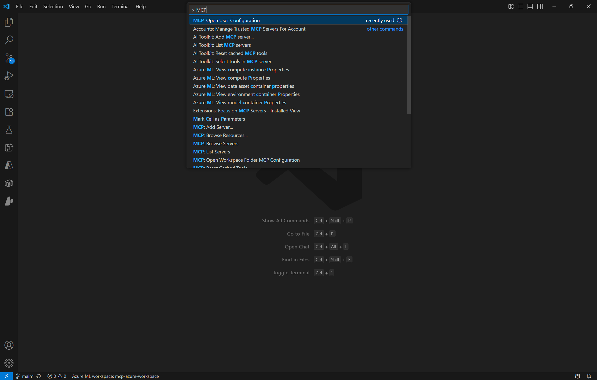
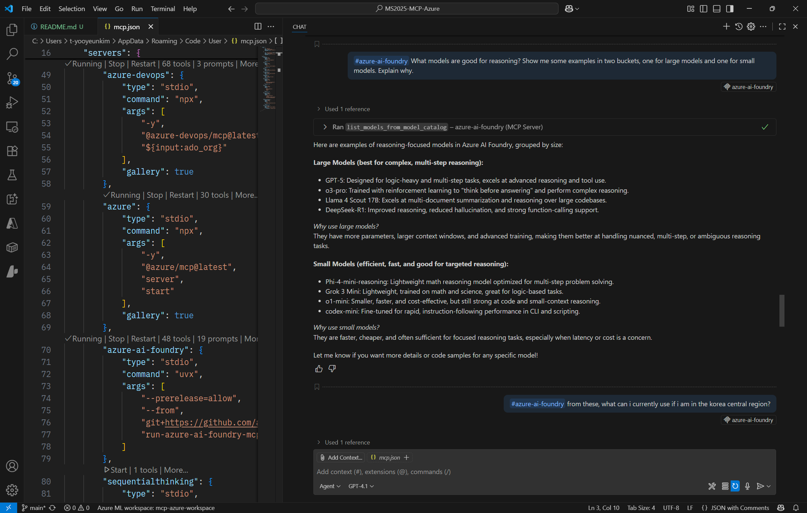
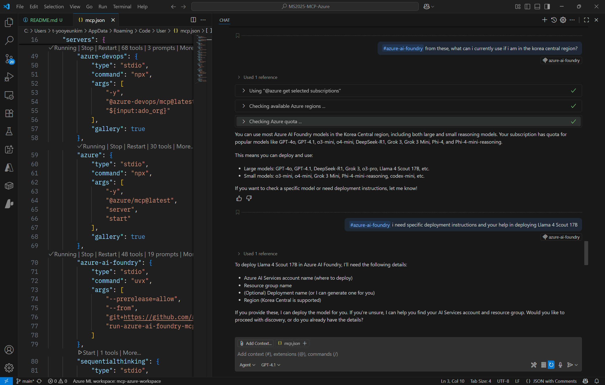

github copilot 을 mcp client로 사용하기

1. vs code에서 mcp configuration 파일(mcp.json)에서 install 된 mcp server 확인

2. github copilot chat toggle open -> agent 모드 설정

---

mcp 서버사용 실습

mcp.json 에서 run server -> running 확인 -> tool 128개 이하 되도록 관련 / 사용할 tool만 선택

1. playwright mcp
(playwright은 뭐하는 mcp 서버인지 간단 설명)

chat 예시: I live in Manchester, UK. Go to https://tfl.gov.uk/ and help me plan travel from Manchester Piccadilly Station to Knightsbridge Station at London. I am going to travel on Friday, 15 August. I am excited to travel to London!

2. azure mcp
https://github.com/Azure/azure-mcp

chat 예시: list up my azure resources // can you provide some information of my azure subscription?

chat 예시: What resource groups, or resources of my subscription are leading to a high cost? I need some management. // can you help me deploy models at azure ai foundry?

3. azure ai foundry mcp
https://github.com/azure-ai-foundry/mcp-foundry
일부 기능 사용하기 위해서는 .env 설정 필요 (.env.example 참조. 상단 github에 나와있음)

chat 예시: What models are good for reasoning? Show me some examples in two buckets, one for large models and one for small models. Explain why. // from these, what can i currently use if i am in the korea central region? // i need specific deployment instructions and your help in deploying Llama 4 Scout 17B

