# Step 1. What is MCP Server?

---

## ✅ 학습 목표 (TL;DR)

* `uv` 기반 Python 프로젝트/가상환경 구성
* `mcp[cli]` 설치 후 **FastMCP** 서버 실행
* **MCP Inspector**에서 `Resources / Prompts / Tools` 상호작용
* **VS Code MCP Servers for agent mode** 확장 설치 및 서버 확인 (Azure, Azure AI Foundry 포함)

---

## 🧰 사전 준비물 (Pre-requisites)

* **Python 3.10+** (권장: 최신 안정 버전; 본 실습은 **3.13.5**에서 검증)

  > 공식 MCP 가이드는 **Python 3.10 이상**을 요구합니다. 또한 `mcp[cli]` 종속성 해석 시 **3.10 미만**에서는 의존성 충돌이 발생할 수 있습니다.
* **uv** (Python 프로젝트/venv/의존성 관리 도구)
* **VS Code** (권장) + 인터넷 연결
* OS: Windows 10/11 (예시 명령은 **Git Bash** 기준)

---

## 🚀 빠른 시작 (명령어 그대로 실행)

```bash
# 1) 프로젝트 생성
uv init MCP-Server

# 2) 경로 이동
cd MCP-Server

# 3) 가상환경 생성 및 활성화
uv venv
source .venv/Scripts/activate   # Git Bash 기준. PowerShell은 .\.venv\Scripts\Activate.ps1

# 4) MCP CLI 포함 설치
uv add "mcp[cli]"
```

---

## 🧩 예제 서버 코드: `server-quickstart.py`

> 해당 코드는 [python-sdk FastMCP Quickstart](https://github.com/modelcontextprotocol/python-sdk/blob/main/examples/snippets/servers/fastmcp_quickstart.py)를 참조하여 작성되었습니다.

### Quickstart 공식 예제
```python
"""
FastMCP quickstart example.
ref. https://github.com/modelcontextprotocol/python-sdk/blob/main/examples/snippets/servers/fastmcp_quickstart.py
"""

from mcp.server.fastmcp import FastMCP

# Create an MCP server
mcp = FastMCP("Demo")


# Add an addition tool
@mcp.tool()
def add(a: int, b: int) -> int:
    """Add two numbers"""
    return a + b


# Add a dynamic greeting resource
@mcp.resource("greeting://{name}")
def get_greeting(name: str) -> str:
    """Get a personalized greeting"""
    return f"Hello, {name}!"


# Add a prompt
@mcp.prompt()
def greet_user(name: str, style: str = "friendly") -> str:
    """Generate a greeting prompt"""
    styles = {
        "friendly": "Please write a warm, friendly greeting",
        "formal": "Please write a formal, professional greeting",
        "casual": "Please write a casual, relaxed greeting",
    }

    return f"{styles.get(style, styles['friendly'])} for someone named {name}."
```

### 2. Add tool

```python
# ========== OPTIONAL ==========
# Add a tool that uses a literal type for style
from typing import Literal

@mcp.tool()
def generate_greeting(
    name: str,
    style: Literal["friendly", "formal", "casual"] = "friendly"
) -> str:
    """Return a ready-made greeting sentence in the given style."""
    styles = {
        "friendly": f"Hi, {name}! It's great to meet you 🙂",
        "formal":   f"Hello {name}. I hope you're doing well. Please let me know if you need any assistance.",
        "casual":   f"Hey {name}! Good to see you 😄",
    }
    return styles.get(style, styles["friendly"])
```

---

## ▶️ 실행 & Inspector 페이지 확인

```bash
uv run mcp dev server-quickstart.py
```
1. **MCP Inspector 시작 페이지**가 표시됩니다.
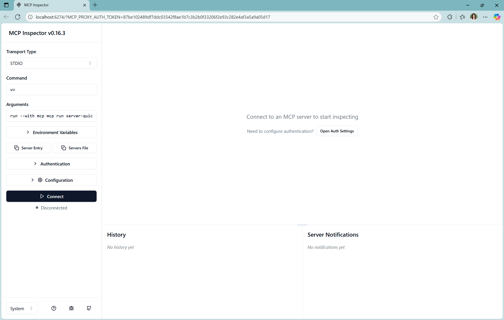

2. **Connect** 버튼 클릭 → 서버와 연결된 화면 확인
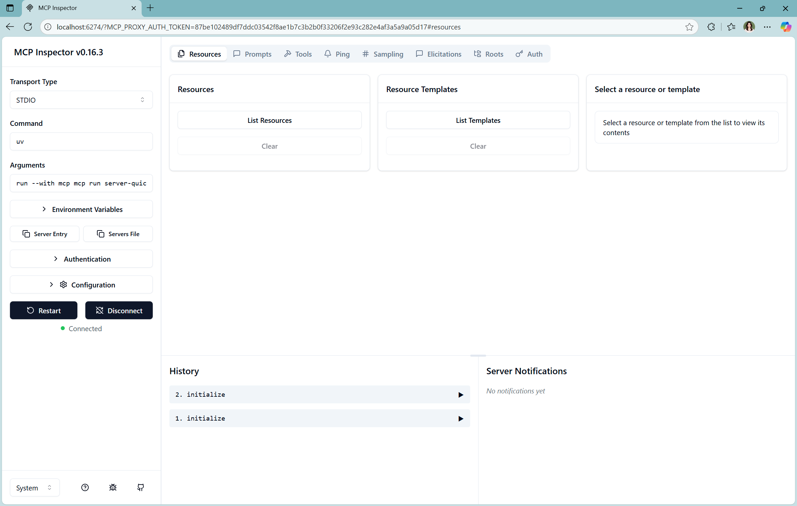

3. **Resources 탭**
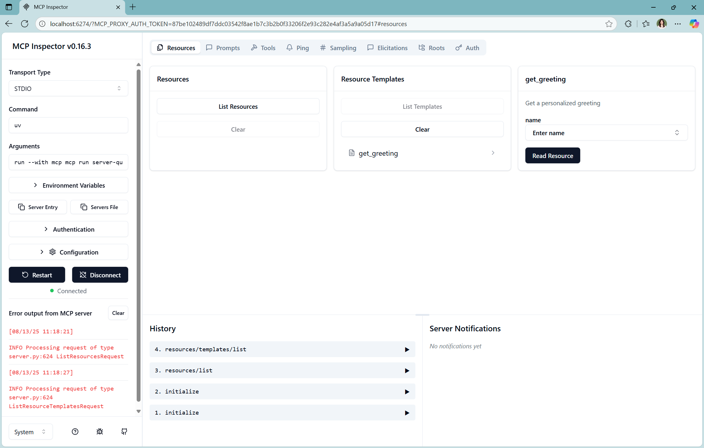
  * *Resource Templates* → `get_greeting` 선택
  * `name` 입력(예: `Sage`) → **Fetch** 후 응답 확인
  * 기대 응답 예시:
    ```json
    {
      "contents": [
        {
          "uri": "greeting://Sage",
          "mimeType": "text/plain",
          "text": "Hello, Sage!"
        }
      ]
    }
    ```
    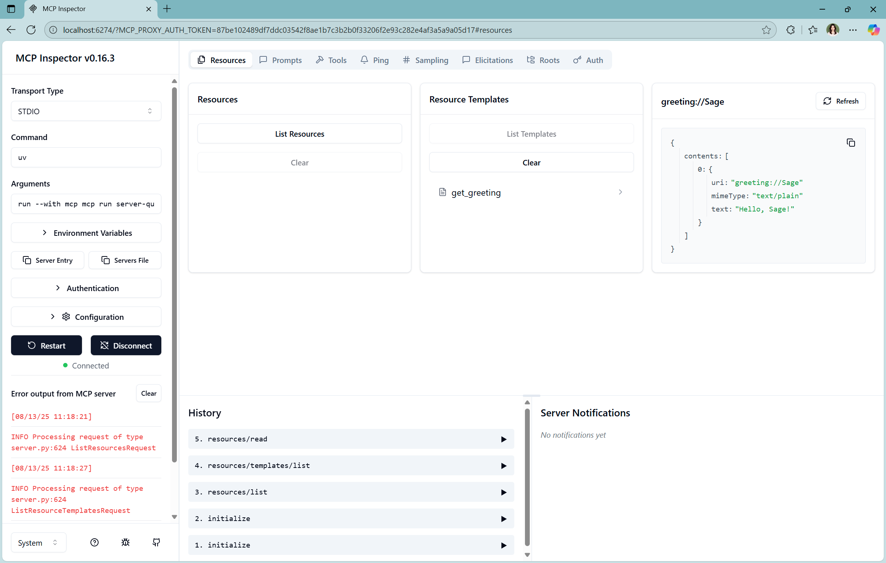

4. **Prompts 탭**
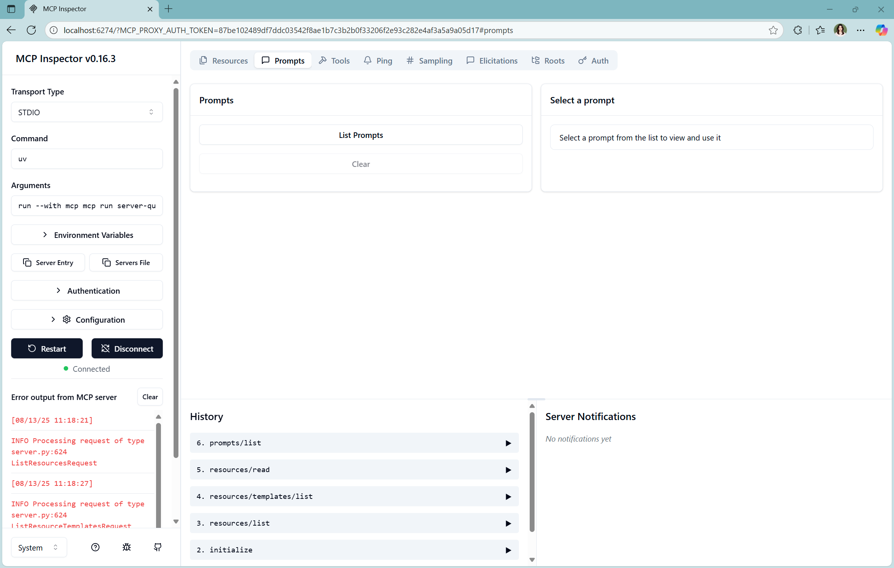
  * *List Prompts* → `greet_user` 선택
  * `name/style` 입력(예: `Sage` / `casual`) → **Get Prompt**로 프롬프트 템플릿 미리보기
  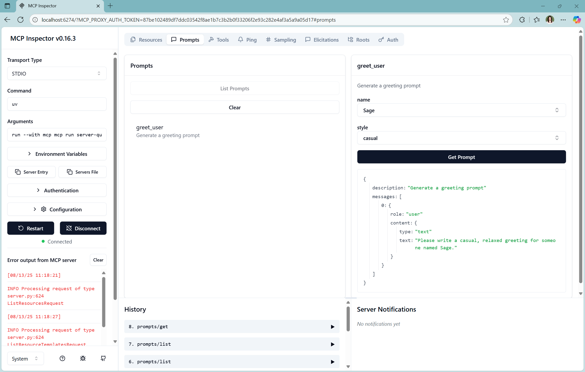

5. **Tools 탭**

  * *List Tools* → `add` 선택 → `a=17, b=98` → **Run Tool**
    * 기대 결과: `{"result": 115}`
  * *List Tools* → `generate_greeting` → `name=Sage, style=casual` → **Run Tool**
    * 기대 결과: `{"result": "Hey Sage! Good to see you 😄"}`
  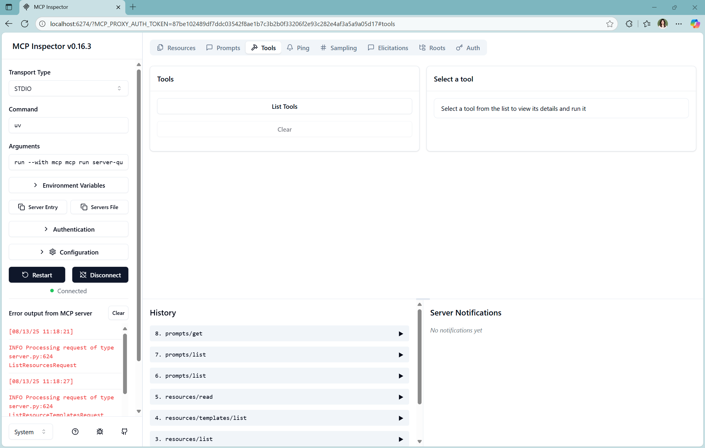
  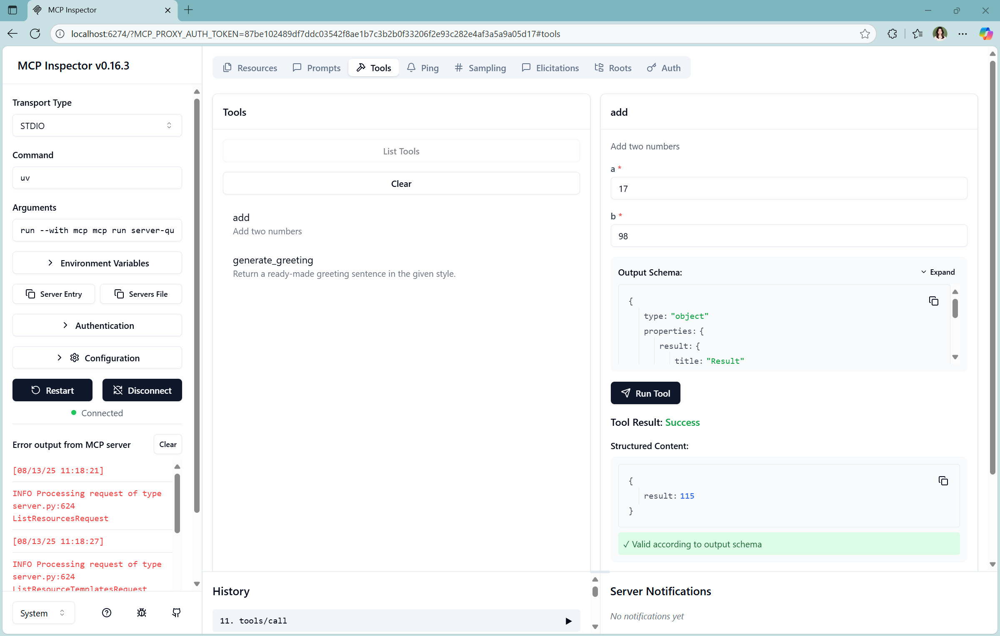
  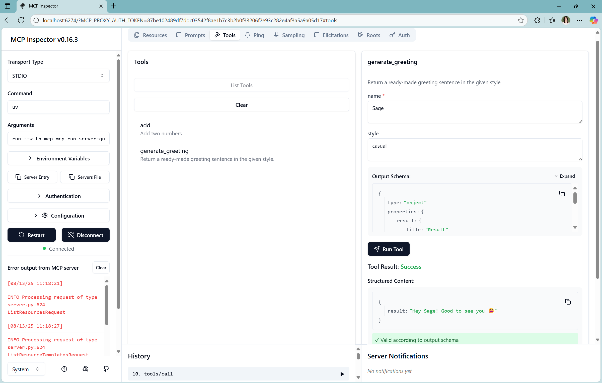

6. 종료
  * Inspector **Disconnect**
  * 터미널에서 `Ctrl + C` → `Terminate batch job (Y/N)?`에 `Y`

### 📚 Inspector Tab에서 무엇을 확인했는가?

* **Resources**: 서버가 노출하는 **데이터 소스**를 URI 패턴으로 제공/조회하는 인터페이스 (예: `greeting://{name}`).
* **Prompts**: 서버가 제공하는 **프롬프트 템플릿/변수 바인딩** 목록과 프리뷰를 노출.
* **Tools**: 서버가 노출하는 함수형 도구(API)를 JSON 스키마 기반 파라미터로 호출.

---

## 🧩 VS Code에서 MCP Server 확장 설치

1. **Extensions** 사이드바에서 `@mcp` 검색 → **Browse MCP Servers** 클릭
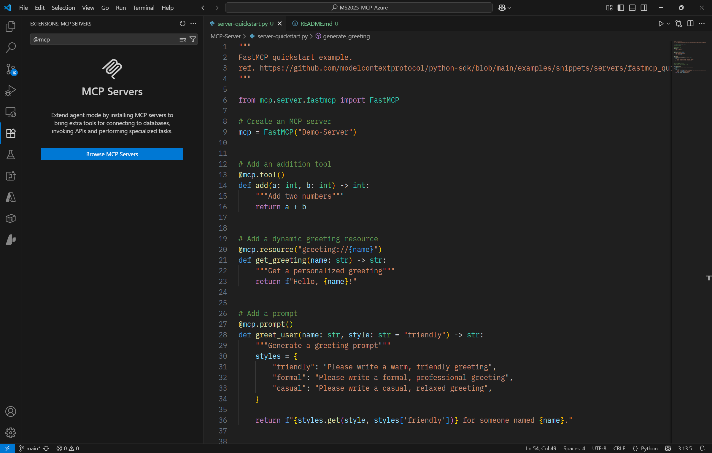

2. **MCP Servers for agent mode** 페이지에서 원하는 서버 설치
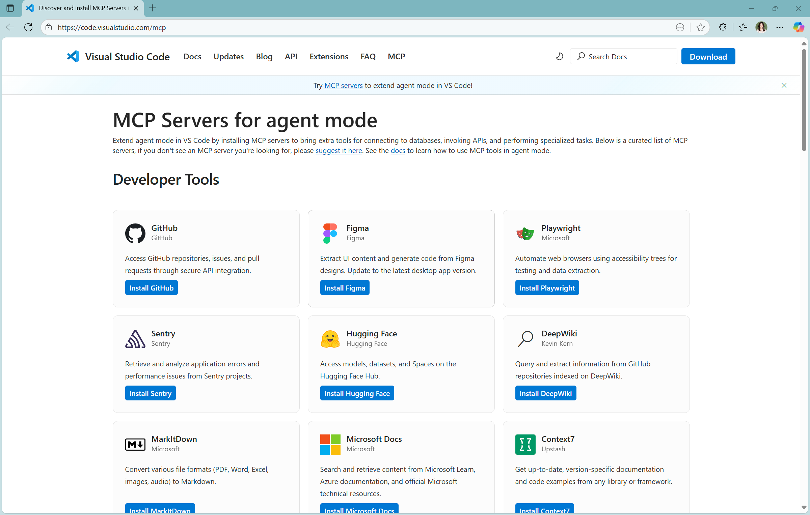
* 원하는 extension이 보이는 목록에 없다면 아래 저장소에서 수동 설치 가능
  * **Azure MCP Server**: [https://github.com/azure/azure-mcp](https://github.com/azure/azure-mcp)
  * **Azure AI Foundry MCP Server**: [https://github.com/azure-ai-foundry/mcp-foundry](https://github.com/azure-ai-foundry/mcp-foundry)
       

3. 설치 완료 후 **설치된 MCP 서버 목록**에서 확인
  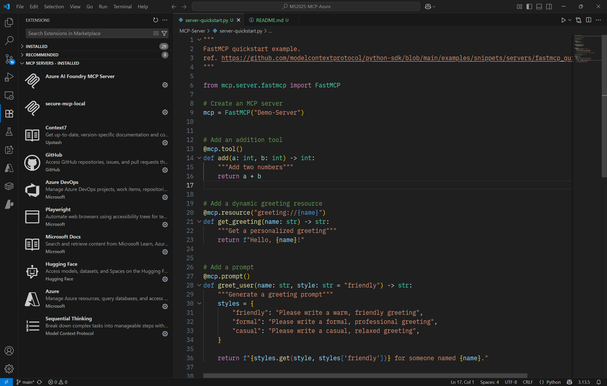

> 💡 이 단계까지 완료되면, **Copilot Agent Mode**에서 해당 서버들을 불러와 대화를 진행할 수 있습니다.