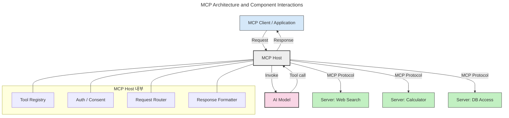
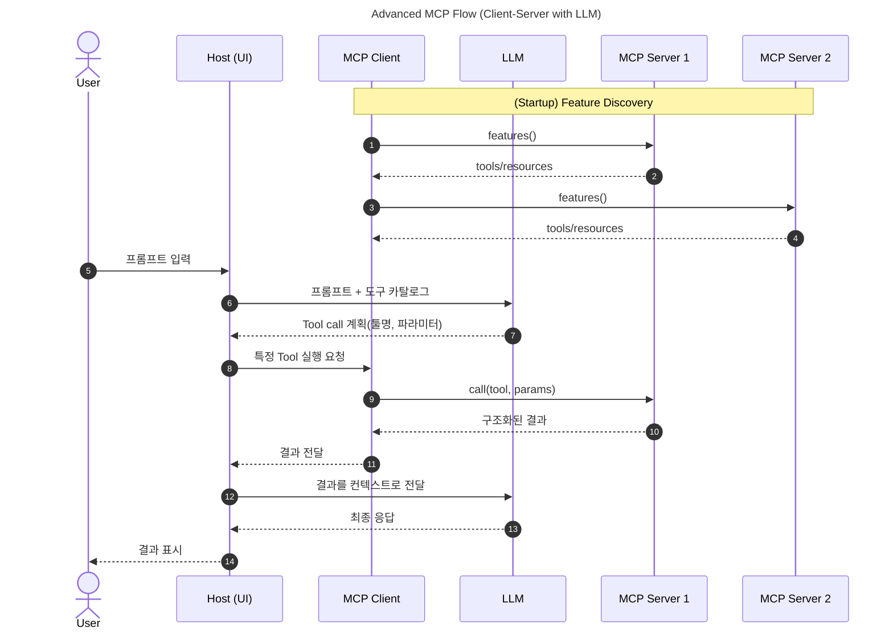
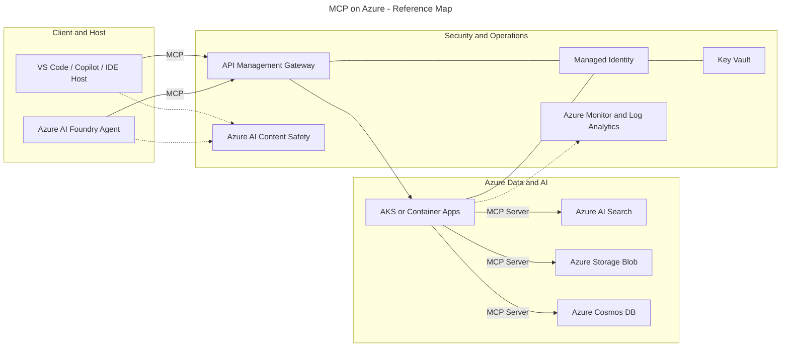
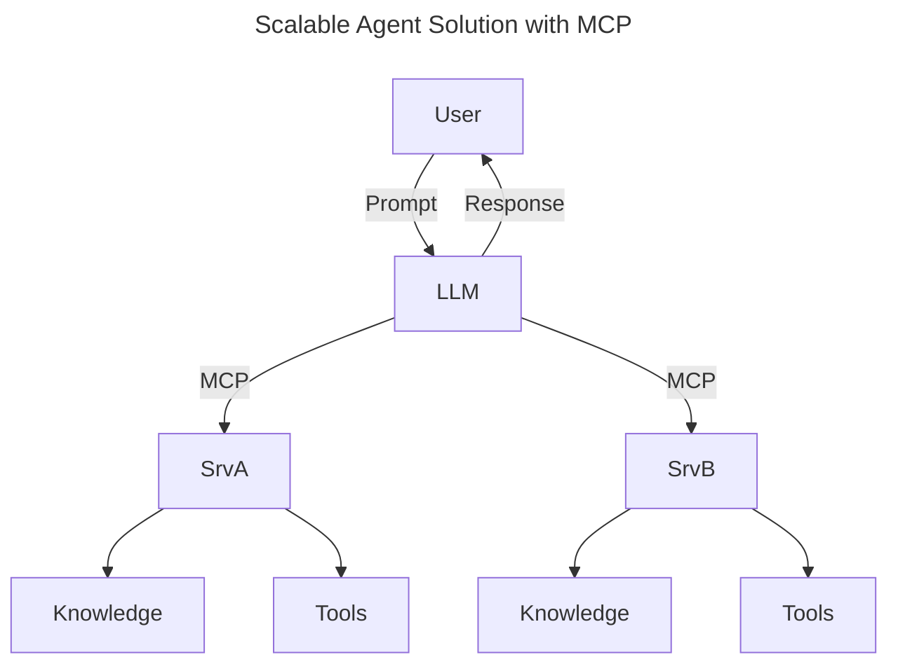

# MS2025-MCP-Azure
MCP with MS Azure: MS CAIP intern

# Repository Quickstart (Per-Folder Template)

이 저장소는 **각 폴더마다 독립적인 uv 기반 Python 프로젝트**로 구성됩니다.
새 폴더(모듈)를 만들거나, 기존 폴더에서 바로 실습을 시작하려면 아래를 따르세요.

---

## 1. 새 폴더(모듈) 만들 때

```bash
# 1) 프로젝트 생성 (원하는 폴더명으로 변경)
uv init <YOUR_FOLDER_NAME>

# 2) 경로 이동
cd <YOUR_FOLDER_NAME>

# 3) 가상환경 생성 및 활성화
uv venv
# Windows (Git Bash)
source .venv/Scripts/activate
# Windows (PowerShell)
# .\.venv\Scripts\Activate.ps1
# macOS/Linux
# source .venv/bin/activate

# 4) MCP CLI 포함 설치
uv add "mcp[cli]"
```

---

## 2. 기존 폴더에서 시작할 때

```bash
cd <EXISTING_FOLDER_NAME>
uv venv
# Windows (Git Bash)
source .venv/Scripts/activate
# Windows (PowerShell)
# .\.venv\Scripts\Activate.ps1
# macOS/Linux
# source .venv/bin/activate

uv add "mcp[cli]"
```

---

## 참고

* 사전 요구사항: Python 설치 및 `uv` 사용 가능 환경 (Python 3.10+)
* 가상환경 비활성화는 `deactivate`

---

# MCP on Azure

> 하단의 내용은 [Microsoft 공식 mcp-for-beginners GitHub Repo](https://github.com/microsoft/mcp-for-beginners)를 참조하여 작성되었습니다.

---

## 🔎 MCP란 무엇인가?

**MCP(Model Context Protocol)** 는 LLM이 **외부 도구/데이터**와 표준화된 방식으로 상호작용하도록 해주는 **오픈 인터페이스**입니다.
복잡해지는 생성형 AI 앱에서 **확장성, 일관성, 재사용성**을 확보하고, 모델·벤더가 달라도 **동일한 규약**으로 도구를 연결할 수 있게 해줍니다.

> 참고: MCP는 “오픈 표준”을 지향하지만, 현재 **IEEE/IETF/W3C/ISO** 등의 표준 기구에서 정식 표준화가 진행되는 것은 아닙니다.

### 왜 표준이 필요한가?

* 각 모델/도구 쌍마다 **맞춤 코드** → 업데이트에 취약, 확장성 낮음
* 벤더별 **비표준 API** → 온보딩/유지보수 비용 증가
* 도구가 늘수록 **브리틀(깨지기 쉬운)** 한 통합 구조

MCP는 다음을 제공합니다:

| 이점                   | 설명                          |
| -------------------- | --------------------------- |
| **Interoperability** | 서로 다른 벤더·모델·도구 간 **호환성** 확보 |
| **Consistency**      | 환경이 달라도 **동일한 동작 방식**       |
| **Reusability**      | 한번 만든 **서버/툴 재사용**          |
| **Velocity**         | **플러그-앤-플레이**로 개발 가속        |

---

## 🧠 MCP 쉽게 이해하기

> **“AI 세계의 USB-C”**
> 기기마다 케이블이 달라 골치였던 시절을 떠올려 보세요. MCP는 모델이 어떤 도구/데이터를 쓰든 **같은 형태로 꽂아 쓰는 규격**을 제공합니다.
> 서버는 “어떤 리소스·프롬프트·툴을 제공하는지”를 표준 포맷으로 알리고, 호스트/클라이언트는 이를 **발견·호출**합니다.

---

## 🧱 아키텍처 한눈에 보기

MCP는 **클라이언트-서버 모델**이며, 실제 모델 러untime을 관리하는 **Host**가 중앙에서 연결과 권한을 조정합니다.



### 구성요소 역할

* **Host**
  모델 실행/대화 UI, 권한·보안·도구 카탈로그 관리, 세션 상태 관리
* **Client**
  서버와 **1:1 연결**을 유지하는 프로토콜 클라이언트. 기능 협상(capability negotiation), 툴 호출 요청/결과 처리
* **Server**
  표준 규격으로 **리소스/프롬프트/툴**을 노출하는 경량 서비스

---

## 🧩 서버가 제공하는 기능(Features)

### 📑 Resources

* **정적/동적 컨텍스트** (로컬 파일, DB 스키마, 문서 저장소, 외부 API 등)
* 예: `file://log.txt`, `database://schema`

### 🧭 Prompts

* **템플릿/워크플로**로 상호작용 패턴 표준화
* 예:

  ```markdown
  Generate a product slogan for {{product}} using {{keywords}}
  ```

### ⛏️ Tools

* 모델이 실행할 **함수형 액션**(이름, 설명, 파라미터 스키마, 구조화된 출력)
* 예(Typescript 개념 예시):

  ```ts
  server.tool("GetProducts", { pageSize: z.number().optional() }, async ({pageSize}) => {
    // call API and return structured result
  });
  ```

---

## 🧪 클라이언트 측 기능: Sampling

* 서버가 **추가 모델 호출**을 요청해 에이전틱(Agentic) 동작을 **재귀적**으로 수행
* 복합 태스크에서 **다단계 추론**/보강 프롬프트 실행

---

## 🔄 정보 흐름(Flow)



---

## 🧩 프로토콜 & 전송

* **기반 프로토콜**: JSON-RPC 2.0
* **전송(Transports)**: **STDIO, SSE, WebSocket**
* **세션/상태**: 대화 맥락, 권한, 리소스 접근을 세션 단위로 유지
* **기능 협상**: 지원 버전/리소스/툴을 상호 교환하여 세션 기능 확정

---

## 🔐 보안·거버넌스 기본 원칙

* **사용자 동의(Consent) 우선**: 어떤 데이터/툴을 쓸지 **명시적 허용**
* **데이터 최소화/프라이버시**: 필요한 범위만 공유, 접근제어 필수
* **툴 안전성**: 파라미터 **스키마 검증**, 예외/에러 **표준 처리**
* **남용 방지**: **레이트 리밋**/취소/진행상황 보고로 서비스 보호

> 워크숍의 **02-Security** 폴더에서 Azure 보안 요소(APIM, Managed Identity, Key Vault, Content Safety, Private Endpoint 등)와 MCP 조합을 다룹니다.

---

## ☁️ Azure Quick Mapping Example



* **Host/Client**: VS Code(확장), Copilot Agent Mode, Azure AI Foundry Agent
* **Server**: AKS/Container Apps 위에서 MCP 서버(도구/리소스/프롬프트 노출)
* **데이터 소스**: AI Search(문서 검색/임베딩), Blob/DB 등
* **보안**: APIM로 **인증/권한/레이트리밋**, **Managed Identity + Key Vault**로 시크릿 관리, **Content Safety**로 프롬프트/출력 안전성
* **관측성**: Monitor/Log Analytics로 **로그/메트릭/추적**

---

## 🌍 실전 적용 시나리오

| 시나리오             | 설명                                                          |
| ---------------- | ----------------------------------------------------------- |
| **엔터프라이즈 문서 검색** | AI Search/Blob의 문서 컨텍스트를 **Resource/Tool**로 노출해 최신 정보 기반 답변 |
| **업무 자동화 에이전트**  | CRM/API 호출, 계산, 워크플로 실행을 **Tool**로 표준화                      |
| **멀티모달 파이프라인**   | 텍스트+이미지/음성 도구를 한 앱에 통합, 모델은 **MCP 규격**으로 호출                 |
| **리얼타임 데이터 접속**  | 외부 API(시세/뉴스 등)를 표준 툴로 연결해 **신선도** 확보                       |

---

## 🚀 Quickstart

### 공식 SDK

* **Python**: [https://github.com/modelcontextprotocol/python-sdk](https://github.com/modelcontextprotocol/python-sdk)
* **TypeScript**: [https://github.com/modelcontextprotocol/typescript-sdk](https://github.com/modelcontextprotocol/typescript-sdk)
* **Java**: [https://github.com/modelcontextprotocol/java-sdk](https://github.com/modelcontextprotocol/java-sdk)
* **C#/.NET**: [https://github.com/modelcontextprotocol/csharp-sdk](https://github.com/modelcontextprotocol/csharp-sdk)

---

## 📡 확장 아키텍처(스케일/다중 서버)



* 서버 추가 시 **에이전트 재학습 없이** 기능 확장(발견→호출)
* 마이크로서비스별 독립 배포/스케일링 용이

---

## 📌 핵심 요약

* **MCP = 모델 ↔ 도구/데이터 표준 인터페이스**
* **Host/Client/Server** 분리로 **확장·교체·재사용**이 쉬움
* **JSON-RPC + STDIO/SSE/WS** 로 **언어 불문** 호환
* **Azure**의 APIM/MI/Key Vault/Content Safety/Monitor와 결합해 **엔터프라이즈급 거버넌스** 확보