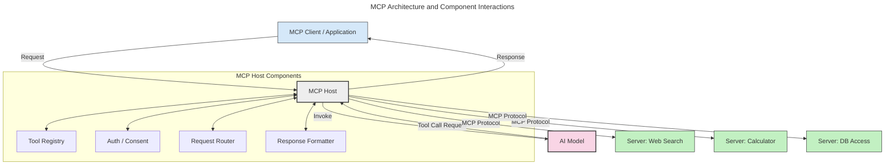
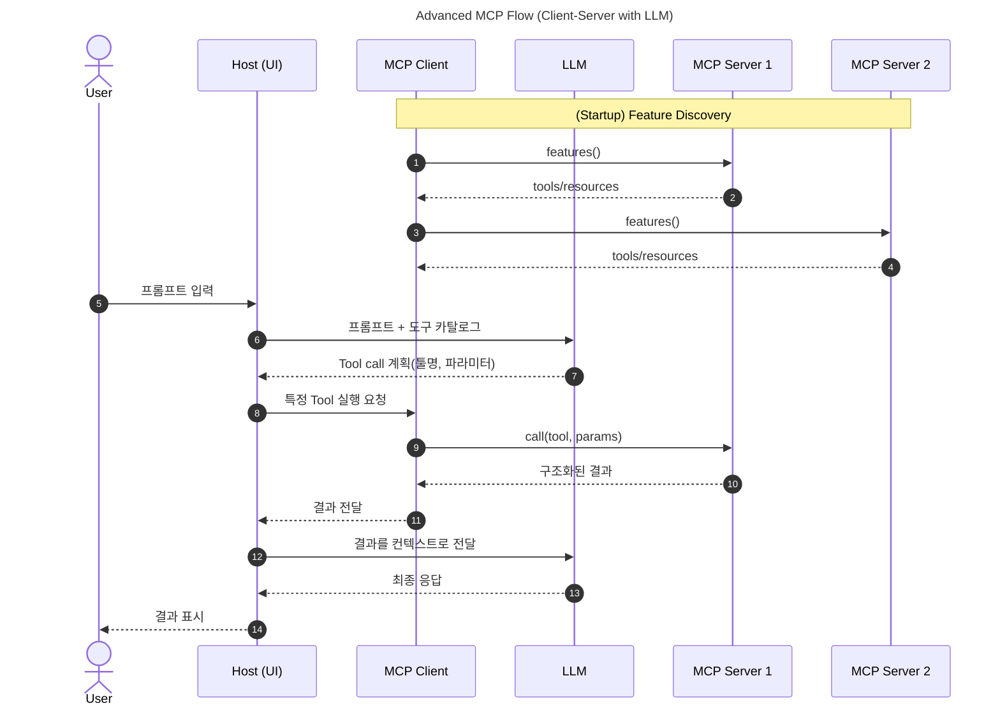
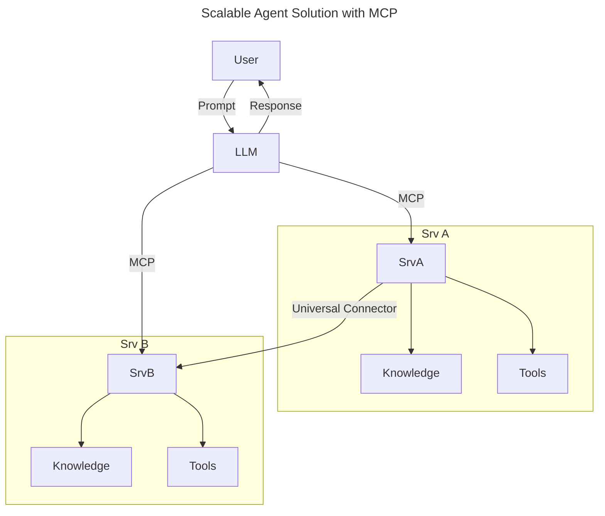

# Repository Quickstart

이 저장소는 **각 폴더마다 독립적인 uv 기반 Python 프로젝트**(Per-Folder Template)로 구성됩니다.
새 폴더(모듈)를 만들거나, 기존 폴더에서 바로 실습을 시작하려면 아래를 따르세요.

---

## 1. 새 폴더(모듈) 만들 때

```bash
# 1) 프로젝트 생성 (원하는 폴더명으로 변경)
uv init <YOUR_FOLDER_NAME>

# 2) 경로 이동
cd <YOUR_FOLDER_NAME>

# 3) 가상환경 생성 및 활성화
uv venv
# Windows (Git Bash)
source .venv/Scripts/activate
# Windows (PowerShell)
# .\.venv\Scripts\Activate.ps1
# macOS/Linux
# source .venv/bin/activate

# 4) MCP CLI 포함 설치
uv add "mcp[cli]"

# 5) 가상환경 비활성화: deactivate
```

---

## 2. 기존 폴더에서 시작할 때

```bash
cd <EXISTING_FOLDER_NAME>
uv venv
# Windows (Git Bash)
source .venv/Scripts/activate
# Windows (PowerShell)
# .\.venv\Scripts\Activate.ps1
# macOS/Linux
# source .venv/bin/activate
uv add "mcp[cli]"
# 가상환경 비활성화: deactivate
```

---

## 참고

* 사전 요구사항: Python 설치 및 `uv` 사용 가능 환경 (Python 3.10+)
  * 공식 MCP 가이드는 **Python 3.10 이상**을 요구합니다. 또한 `mcp[cli]` 사용 시 **3.10 미만**에서는 의존성 충돌이 발생할 수 있습니다.

---

# 🚀 MCP on Azure

> 하단의 내용은 [Microsoft 공식 mcp-for-beginners GitHub Repo](https://github.com/microsoft/mcp-for-beginners)를 참조하여 작성되었습니다.

---

## 🔎 MCP란 무엇인가?

**MCP(Model Context Protocol)** 는 LLM이 **외부 도구/데이터**와 표준화된 방식으로 상호작용하도록 해주는 **오픈 인터페이스**입니다.
복잡해지는 생성형 AI 앱에서 **확장성, 일관성, 재사용성**을 확보하고, 모델·벤더가 달라도 **동일한 규약**으로 도구를 연결할 수 있게 해줍니다(**avoiding vendor lock-in**).

> 참고: MCP는 “open standard”를 지향하지만, 현재 **IEEE/IETF/W3C/ISO** 등의 표준 기구에서 정식 표준화가 진행되는 것은 아닙니다.

### 왜 표준이 필요한가?

* 각 모델/도구 쌍마다 **일원화되지 않은 코드** → 업데이트에 취약, 확장성 낮음
* 도구가 증가할수록 **brittle**한 통합 구조 → 변경에 쉽게 깨지는(ad-hoc) 일회성 커스텀 솔루션
* 벤더 별 **표준화되지 않은 API** → 온보딩/유지보수 비용 증가

💡 MCP는 다음을 제공합니다:

| 이점                   | 설명                          |
| -------------------- | --------------------------- |
| **Interoperability** | 서로 다른 벤더·모델·도구 간 **호환성** 확보 |
| **Consistency**      | 환경(플랫폼·도구)이 달라도 **동일한 동작 방식**       |
| **Reusability**      | 한번 만든 도구를 플랫폼·시스템 간 **재사용** 가능          |
| **Accelerated Development**         | 표준화된, **플러그-앤-플레이** 인터페이스로 개발 가속        |

---

## 🧠 MCP == Universal Standard for AI Interactions

> **“AI 세계의 USB-C”**
> 기기마다 케이블이 달라 골치였던 시절을 떠올려 보세요. MCP는 모델이 어떤 도구/데이터를 쓰든 **같은 형태로 꽂아 쓰는 규격**을 제공합니다.
> 서버는 “어떤 **리소스·프롬프트·툴**을 제공하는지”를 표준 포맷으로 알리고, 호스트/클라이언트는 이를 **발견·호출**합니다.

---

## 🧱 아키텍처 한눈에 보기

MCP는 **클라이언트-서버 모델**이며, 실제 모델 runtime을 관리하는 **Host**가 중앙에서 연결과 권한을 조정합니다.

### Request Flow

1. 최종 사용자나 그를 대신하는 소프트웨어가 요청을 발생시킵니다.
2. MCP 클라이언트가 이 요청을 AI 모델 런타임을 관리하는 MCP 호스트로 전달합니다.
3. AI 모델은 사용자 프롬프트를 받은 뒤, 필요하면 하나 이상의 툴 호출을 통해 외부 도구나 데이터 접근을 요청할 수 있습니다.
4. 이때 모델이 직접 서버와 통신하는 것이 아니라, MCP 호스트가 표준화된 프로토콜로 적절한 MCP 서버(들)와 통신합니다.



### 구성요소 역할

* **Host**:
  모델 실행/대화 UI, 권한·보안·도구 카탈로그 관리, 서버연결·세션상태 관리, 도구의 출력 값을 **모델이 이해할 수 있는 형식**으로 정리
* **Client**:
  서버와 **1:1 연결**을 유지하는 프로토콜 클라이언트. 기능 협상(capability negotiation), 툴 호출 요청/결과 처리
* **Server**:
  표준 규격으로 **리소스/프롬프트/툴**을 노출하는 경량 서비스


짧은 메모
* **Host = App (UI)** 구현이 일반적(예: VS Code, Claude Desktop).
* 다만 **헤드리스 Host**도 가능하며, 이 경우 UI는 다른 프로세스/앱이 맡고 Host는 오케스트레이션과 연결·보안을 담당합니다.


---

## 🧩 서버가 제공하는 Primitives

### 📑 Resources

* **정적/동적 컨텍스트** (로컬 파일, DB 스키마, 문서 저장소, 외부 API 등)
* 예: `file://log.txt`, `database://schema`, `api://weather`
자연스럽게 옮기면:
* URI로 식별되며, `resources/list` 메서드로 목록(발견)을, `resources/read` 메서드로 개별 리소스 읽기(가져오기)를 지원합니다.
  * **discovery(`resources/list`)**: 서버가 제공하는 리소스들의 **목록/메타데이터**를 돌려줌
  * **retrieval(`resources/read`)**: 지정한 **URI의 실제 내용**(텍스트/바이너리 등)을 반환


### 🧭 Prompts

* **템플릿/워크플로**로 LLMs과의 상호작용 패턴 표준화
* 예:
  ```markdown
  Generate a product slogan for {{product}} using {{keywords}}
  ```
* 프롬프트는 **변수 치환**을 지원하며, `prompts/list`로 **발견(목록 조회)** 하고 `prompts/get`으로 **가져올 수 있습니다**.

### ⛏️ Tools

* 모델이 실행할 **함수형 액션**(이름, 설명, 파라미터 스키마, 구조화된 출력)
* 예(Typescript 개념 예시):

  ```ts
  server.tool("GetProducts", { pageSize: z.number().optional() }, async ({pageSize}) => {
    // call API and return structured result
  });
  ```
* 도구는 매개변수 **유효성 검사**를 위해 **JSON Schema**로 정의되며, `tools/list`로 **발견(목록 조회)** 하고 `tools/call`로 **실행**합니다.

---
## 🧩 클라이언트가 제공하는 Primitives

### 🧪 Sampling

* 서버가 **추가 모델 호출**을 요청해 Agentic 동작을 **재귀적**으로 수행
* 복합 태스크에서 **다단계 추론**/보강 프롬프트 실행

### 🙋 Elicitation
- 부족한 정보나 위험 작업 시, 클라이언트 **UI로 사용자 입력/승인**을 요청
- 실행 도중 **동적 파라미터 수집**·단계별 상호작용(확인 대화 등) 구성

### 📜 Logging
- 서버가 **구조화 로그/상태**를 클라이언트로 보내 **디버깅·모니터링** 지원
- 오류 맥락·성능 지표·감사 추적 등 **운영 가시성** 확보

---

## 🔄 Information Flow


<details>
  <summary>다이어그램 설명</summary>

1. **(Startup) 기능 탐색**: `Client → S1/S2`로 `features()` 호출 → 각 서버의 **tools/resources 카탈로그** 수집.
2. **사용자 입력**: `User → Host`로 프롬프트 입력.
3. **모델 호출 준비**: `Host → LLM`으로 **프롬프트 + 도구 카탈로그** 전달.
4. **도구 계획 수립**: `LLM → Host`로 사용할 **툴명**과 **파라미터** 제안.
5. **도구 실행 위임**: `Host → Client`에 **특정 툴 실행 요청**.
6. **서버 호출**: `Client → S1`로 `call(tool, params)` 실행.
7. **결과 수신**: `S1 → Client`에 **구조화된 결과** 반환.
8. **호스트 전달**: `Client → Host`로 결과 전달.
9. **컨텍스트 확장**: `Host → LLM`에 결과를 **추가 컨텍스트**로 제공.
10. **최종 응답**: `LLM → Host → User`로 **최종 답변** 생성·표시.

</details>

---

## 📡 프로토콜 & 전송
* **기반 프로토콜**: 모든 메시지는 **JSON-RPC 2.0**(메서드/응답/알림) 사용. 초기화 시 **프로토콜 버전(YYYY-MM-DD)** 협상으로 호환성 보장.
* **세션 라이프사이클**: Host가 서버와 연결 시작 → **초기화·기능 협상** → 상태를 유지하는 **stateful 세션**에서 다회 상호작용 및 **실시간 알림** 지원.
* **기능 협상(Discovery)**: 양측이 지원 기능 교환 - **서버 프리미티브**(tools/resources/prompts)와 **클라이언트 프리미티브**(sampling/elicitation/logging) 확인.
* **전송(Transport)**:
  * **STDIO**: 동일 머신 로컬 프로세스 간 통신, 네트워크 오버헤드 없음.
  * **Streamable HTTP**: 요청은 HTTP POST, 응답 스트리밍은 **SSE** 선택적 지원. 동일 JSON-RPC 포맷을 유지하는 **전송 추상화**로 로컬-원격 전환 용이.
* **인증/보안**: HTTP 인증(Bearer 토큰·API 키·커스텀 헤더) 사용 가능, **OAuth 기반 토큰** 권장.

---

## 🔐 보안·거버넌스 기본 원칙

* **사용자 동의(Consent) 우선**: 어떤 데이터/툴을 쓸지 **명시적 허용**
* **데이터 최소화/프라이버시**: 필요한 범위만 공유, 접근제어 필수
* **툴 안전성**: 파라미터 **스키마 검증**, 예외/에러 **표준 처리**
* **남용 방지**: **레이트 리밋**/취소/진행상황 보고로 서비스 보호

---

## ☁️ Azure Quick Mapping Example

```mermaid
---
title: MCP on Azure - Reference Map
---
flowchart LR
  %% --- Nodes ---
  subgraph Client_Host [Client & Host]
    VS[VS Code / Copilot (Host)]
    Agent[Azure AI Foundry Agent (Host)]
    Cli[MCP Client (per-server connector)]
    VS --> Cli
    Agent --> Cli
  end

  subgraph Azure_Data_AI [Azure Data & AI]
    AKS[AKS or Container Apps (MCP Server)]
    AISearch[Azure AI Search]
    Storage[Azure Storage Blob]
    Cosmos[Azure Cosmos DB]
  end

  subgraph SecOps [Security & Operations]
    APIM[API Management Gateway]
    MI[Managed Identity]
    KV[Key Vault]
    CAS[Azure AI Content Safety]
    Mon[Azure Monitor / Log Analytics]
  end

  %% --- Edges (Transport / Calls) ---
  Cli -->|MCP (JSON-RPC over HTTP/SSE)| APIM
  APIM -->|HTTP (proxy to backend)| AKS

  AKS -->|SDK/REST| AISearch
  AKS -->|SDK/REST| Storage
  AKS -->|SDK/REST| Cosmos

  %% --- Security / Observability ---
  APIM -.->|uses MI to fetch secrets| KV
  AKS -.->|workload identity| MI
  MI -.->|secrets/keys| KV

  VS -.->|prompt/output scanning| CAS
  Agent -.->|prompt/output scanning| CAS
  AKS -.->|logs/metrics| Mon
```

* **Host/Client**: VS Code(확장), Copilot Agent Mode, Azure AI Foundry Agent
* **Server**: AKS/Container Apps 위에서 MCP 서버(도구/리소스/프롬프트 노출)
* **데이터 소스**: AI Search(문서 검색/임베딩), Blob/DB 등
* **보안**: APIM로 **인증/권한/레이트리밋**, **Managed Identity + Key Vault**로 시크릿 관리, **Content Safety**로 프롬프트/출력 안전성
* **관측성**: Monitor/Log Analytics로 **로그/메트릭/추적**

---

## 🌍 실전 적용 시나리오

| 시나리오             | 설명                                                          |
| ---------------- | ----------------------------------------------------------- |
| **엔터프라이즈 문서 검색** | AI Search/Blob의 문서 컨텍스트를 **Resource/Tool**로 노출해 최신 정보 기반 답변 |
| **업무 자동화 에이전트**  | CRM/API 호출, 계산, 워크플로 실행을 **Tool**로 표준화                      |
| **멀티모달 파이프라인**   | 텍스트+이미지/음성 도구를 한 앱에 통합, 모델은 **MCP 규격**으로 호출                 |
| **리얼타임 데이터 접속**  | 외부 API(시세/뉴스 등)를 표준 툴로 연결해 **신선도** 확보                       |

---

## 🚀 Quickstart

### 공식 SDK

* **Python**: [https://github.com/modelcontextprotocol/python-sdk](https://github.com/modelcontextprotocol/python-sdk)
* **TypeScript**: [https://github.com/modelcontextprotocol/typescript-sdk](https://github.com/modelcontextprotocol/typescript-sdk)
* **Java**: [https://github.com/modelcontextprotocol/java-sdk](https://github.com/modelcontextprotocol/java-sdk)
* **C#/.NET**: [https://github.com/modelcontextprotocol/csharp-sdk](https://github.com/modelcontextprotocol/csharp-sdk)

---

## 📡 확장 아키텍처 Example (스케일/다중 서버)



* 서버 추가 시 **에이전트 재학습 없이** 기능 확장(발견→호출)
* 마이크로서비스별 독립 배포/스케일링 용이

---

## 📌 핵심 요약

* **MCP = 모델 ↔ 도구/데이터 표준 인터페이스**
* **Host/Client/Server** 분리로 **확장·교체·재사용**이 쉬움
* **JSON-RPC + STDIO/HTTP+SSE** 로 **언어 불문** 호환
* **Azure**의 APIM/MI/Key Vault/Content Safety/Monitor와 결합해 **엔터프라이즈급 거버넌스** 확보 가능